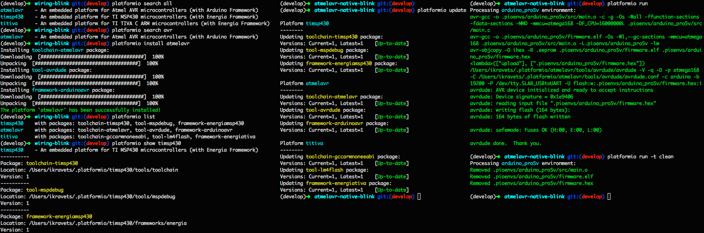

PlatformIO
==========

.. image:: https://travis-ci.org/ivankravets/platformio.svg?branch=develop
    :target: https://travis-ci.org/ivankravets/platformio
    :alt: Build Status
.. image:: https://gemnasium.com/ivankravets/platformio.png
    :target: https://gemnasium.com/ivankravets/platformio
    :alt: Dependency Status
.. image:: https://pypip.in/version/platformio/badge.png
    :target: https://pypi.python.org/pypi/platformio/
    :alt: Latest Version
.. image:: https://pypip.in/download/platformio/badge.png
    :target: https://pypi.python.org/pypi/platformio/
    :alt: Downloads
.. image:: https://pypip.in/license/platformio/badge.png
    :target: https://pypi.python.org/pypi/platformio/
    :alt:  License

`Documentation <http://docs.platformio.ikravets.com>`_ |
`Project Examples <https://github.com/ivankravets/platformio/tree/develop/examples>`_ |
`Bugs/Questions <https://github.com/ivankravets/platformio/issues>`_ |
`Blog <http://www.ikravets.com/category/computer-life/platformio>`_ |
`Twitter <https://twitter.com/smartanthill>`_

**PlatformIO** is a cross-platform code builder and library manager.

* `Quickstart <http://docs.platformio.ikravets.com/en/latest/quickstart.html>`_
* `Installation <http://docs.platformio.ikravets.com/en/latest/installation.html>`_
* `Project Configuration File <http://docs.platformio.ikravets.com/en/latest/projectconf.html>`_
* `Platforms & Embedded Boards <http://docs.platformio.ikravets.com/en/latest/platforms/index.html>`_
* `User Guide <http://docs.platformio.ikravets.com/en/latest/userguide/index.html>`_
* `IDE Integration <http://docs.platformio.ikravets.com/en/latest/ide.html>`_
* `Release History <http://docs.platformio.ikravets.com/en/latest/history.html>`_

You have no need to install any *IDE* or compile any tool chains. *PlatformIO*
has pre-built different development platforms including: compiler, debugger,
uploader (for embedded boards) and many other useful tools.

**PlatformIO** allows developer to compile the same code with different
platforms using only one command
`platformio run <http://docs.platformio.ikravets.com/en/latest/userguide/cmd_run.html>`_.
This happens due to
`Project Configuration File <http://docs.platformio.ikravets.com/en/latest/projectconf.html>`_
where you can setup different environments with specific
options: platform type, firmware uploading settings, pre-built framework
and many more.

**PlatformIO** is well suited for **embedded development**. It can:

* Automatically analyse dependency
* Reliably detect build changes
* Build framework or library source code to static library
* Build *ELF* (executable and linkable firmware)
* Convert *ELF* to *HEX* or *BIN* file
* Extract *EEPROM* data
* Upload firmware to your device

It has support for many popular embedded platforms like these:

* ``atmelavr`` `Atmel AVR <http://en.wikipedia.org/wiki/Atmel_AVR>`_
  (including `Arduino <http://www.arduino.cc>`_ based boards)
* ``timsp430`` `TI MSP430 <http://www.ti.com/lsds/ti/microcontroller/16-bit_msp430/overview.page>`_
  (including `MSP430 LaunchPads <http://www.ti.com/ww/en/launchpad/launchpads-msp430.html>`_)
* ``titiva`` `TI TIVA C <http://www.ti.com/lsds/ti/microcontroller/tiva_arm_cortex/c_series/overview.page>`_
  (including `TIVA C Series LaunchPads <http://www.ti.com/ww/en/launchpad/launchpads-connected.html>`_)

Licence
-------

Copyright (C) 2014 Ivan Kravets

Licenced under the MIT Licence.

