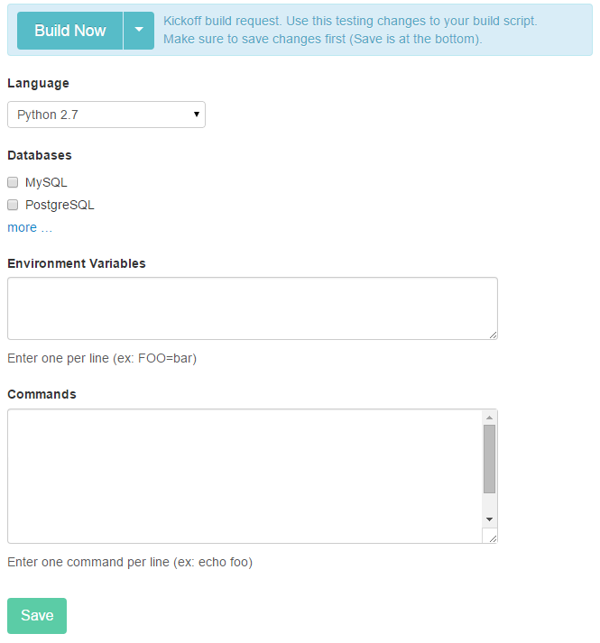
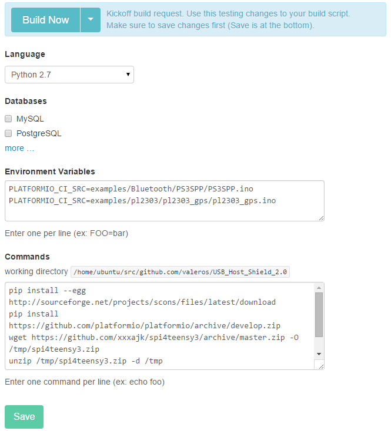

..  Copyright 2014-2016 Ivan Kravets <me@ikravets.com>
    Licensed under the Apache License, Version 2.0 (the "License");
    you may not use this file except in compliance with the License.
    You may obtain a copy of the License at
       http://www.apache.org/licenses/LICENSE-2.0
    Unless required by applicable law or agreed to in writing, software
    distributed under the License is distributed on an "AS IS" BASIS,
    WITHOUT WARRANTIES OR CONDITIONS OF ANY KIND, either express or implied.
    See the License for the specific language governing permissions and
    limitations under the License.

.. _ci_drone:

Drone
=====

`Drone <https://drone.io>`_  is a hosted continuous integration service.
It enables you to conveniently set up projects to automatically build, test,
and deploy as you make changes to your code to
`GitHub <http://en.wikipedia.org/wiki/GitHub>`_ and
`BitBucket <http://en.wikipedia.org/wiki/Bitbucket>`_ repositories.

Drone is configured by modifying settings in your project control panel.

Drone automatically detects when a commit has been made and pushed to a
GitHub repository that is using Drone, and each time this happens, it will
try to build the project using :ref:`cmd_ci` command. This includes commits to
all branches, not just to the master branch. Drone will also build and run
pull requests. When that process has completed, it will notify a developer in
the way it has been configured to do so — for example, by sending an email
containing the build results (showing success or failure). It can be
configured to build project on a range of different :ref:`platforms`.

.. contents::

Integration
-----------

Please fill all fields for your project in the Drone control panel:

`Environment Variables`:

.. code-block:: bash

    PLATFORMIO_CI_SRC=path/to/source/file.c
    PLATFORMIO_CI_SRC=path/to/source/file.ino
    PLATFORMIO_CI_SRC=path/to/source/directory

`Commands`:

.. code-block:: bash

    pip install -U platformio
    platformio ci --board=TYPE_1 --board=TYPE_2 --board=TYPE_N

For more details as for PlatformIO build process please look into :ref:`cmd_ci`
command.

Examples
--------

1. Integration for `USB_Host_Shield_2.0 <https://github.com/felis/USB_Host_Shield_2.0>`_
   project. The ``circle.yml`` configuration file:

`Environment Variables`:

.. code-block:: bash

    PLATFORMIO_CI_SRC=examples/Bluetooth/PS3SPP/PS3SPP.ino
    PLATFORMIO_CI_SRC=examples/pl2303/pl2303_gps/pl2303_gps.ino

`Commands`:

.. code-block:: bash

    pip install -U platformio
    wget https://github.com/xxxajk/spi4teensy3/archive/master.zip -O /tmp/spi4teensy3.zip
    unzip /tmp/spi4teensy3.zip -d /tmp
    platformio ci --lib="." --lib="/tmp/spi4teensy3-master" --board=uno --board=teensy31 --board=due

