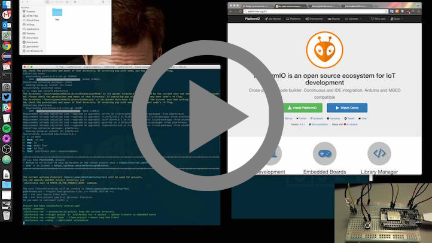

..  Copyright 2014-2016 Ivan Kravets <me@ikravets.com>
    Licensed under the Apache License, Version 2.0 (the "License");
    you may not use this file except in compliance with the License.
    You may obtain a copy of the License at
       http://www.apache.org/licenses/LICENSE-2.0
    Unless required by applicable law or agreed to in writing, software
    distributed under the License is distributed on an "AS IS" BASIS,
    WITHOUT WARRANTIES OR CONDITIONS OF ANY KIND, either express or implied.
    See the License for the specific language governing permissions and
    limitations under the License.

.. _demo:

Demo & Projects
===============

.. contents::

Project Examples
----------------

Preconfigured demo projects are located in `PlatformIO GitHub <https://github.com/platformio/platformio/tree/develop/examples>`_ repository.

Wiring Blink
------------

.. image:: _static/platformio-demo-wiring.gif

Used in demo
~~~~~~~~~~~~

1. Source code of `Wiring Blink Example <https://github.com/platformio/platformio/tree/develop/examples/wiring-blink>`_
2. :ref:`cmd_run` command
3. :ref:`platformio run -t upload <cmd_run>` command.

Platform Manager
----------------

Used in demo
~~~~~~~~~~~~

1. :ref:`userguide_platforms`
2. :ref:`cmd_platforms_list` command
3. :ref:`platformio platforms search avr <cmd_platforms_search>` command
4. :ref:`platformio platforms show teensy <cmd_platforms_show>` command
5. :ref:`cmd_platforms_update` command.

Library Manager
---------------

Used in demo
~~~~~~~~~~~~

1. :ref:`userguide_lib`
2. :ref:`platformio lib search 1-wire <cmd_lib_search>` command
3. :ref:`platformio lib install 54 <cmd_lib_install>` command
4. :ref:`platformio lib search -f mbed <cmd_lib_search>` command
5. :ref:`platformio lib search -k rf <cmd_lib_search>` command
6. :ref:`platformio lib search radiohead <cmd_lib_search>` command
7. :ref:`platformio lib install 124 --version "1.40" <cmd_lib_install>` command
8. :ref:`platformio lib show 124 <cmd_lib_show>` command
9. :ref:`cmd_lib_update` command.

Over-the-Air update for ESP8266
-------------------------------

Used in demo
~~~~~~~~~~~~

1. :ref:`cmd_run` command
2. :ref:`platformio run -t upload <cmd_run>` command.
