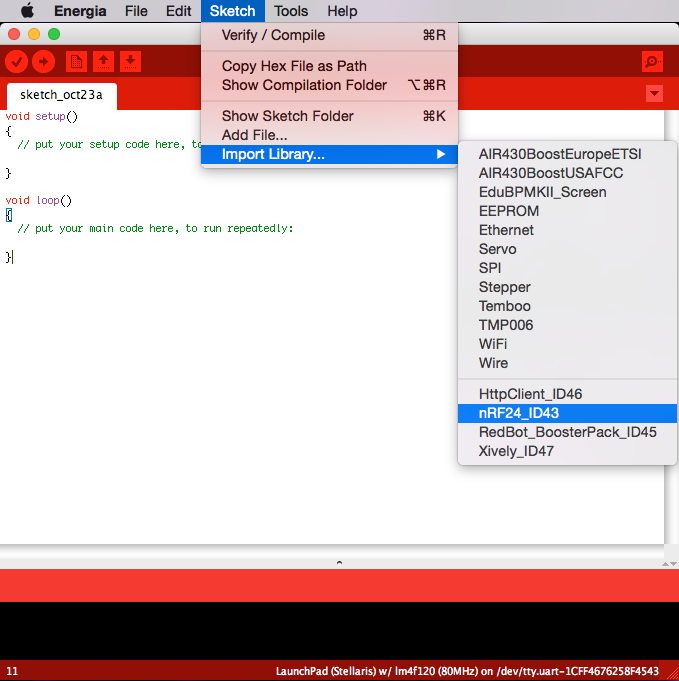

.. _ide:

IDE Integration
===============

.. contents::

Arduino IDE
-----------

.. image:: _static/ide-platformio-arduino.png
    :target: http://www.ikravets.com/computer-life/platformio/2014/10/07/integration-of-platformio-library-manager-to-arduino-and-energia-ides

* `Integration of PlatformIO library manager to Arduino IDE <http://www.ikravets.com/computer-life/platformio/2014/10/07/integration-of-platformio-library-manager-to-arduino-and-energia-ides>`_

Eclipse
-------

.. image:: _static/ide-platformio-eclipse.png
    :target: http://www.ikravets.com/computer-life/programming/2014/06/20/building-and-debugging-atmel-avr-arduino-based-project-using-eclipse-ideplatformio

* `Building and debugging Atmel AVR (Arduino-based) project using Eclipse IDE+PlatformIO <http://www.ikravets.com/computer-life/programming/2014/06/20/building-and-debugging-atmel-avr-arduino-based-project-using-eclipse-ideplatformio>`_
* `More examples (TI MSP430, TI TIVA and etc) <https://github.com/ivankravets/platformio/tree/develop/examples/ide-eclipse>`_

Energia IDE
-----------

* `Integration of PlatformIO library manager to Energia IDE <http://www.ikravets.com/computer-life/platformio/2014/10/07/integration-of-platformio-library-manager-to-arduino-and-energia-ides>`_

VIM
---

.. image:: _static/ide-platformio-vim.png

Recommended bundles:

* Syntax highlight - `Arduino-syntax-file <https://github.com/vim-scripts/Arduino-syntax-file>`_
* Code Completion - `YouCompleteMe <https://github.com/Valloric/YouCompleteMe>`_
* Syntax checking - `Syntastic <https://github.com/scrooloose/syntastic>`_

Put to the project directory ``Makefile`` wrapper with contents:

.. code-block:: make

    # Uncomment lines below if you have problems with $PATH
    #SHELL := /bin/bash
    #PATH := /usr/local/bin:$(PATH)

    all:
        platformio run -t upload

    clean:
        platformio run -t clean

Now, in VIM ``cd /path/to/this/project`` and press ``Ctrl+B`` or ``Cmd+B``
(Mac). *PlatformIO* should compile your source code from the ``src`` directory,
make firmware and upload it.
