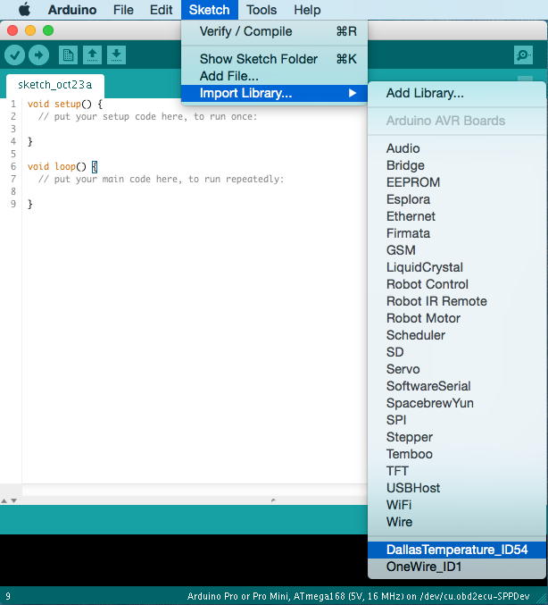

.. _ide_arduino:

Arduino
=======

The open-source `Arduino Software (IDE) <http://arduino.cc/en/main/software>`_
makes it easy to write code and upload it to the board. It runs on *Windows,
Mac OS X, and Linux*. The environment is written in *Java* and based on
*Processing* and other open-source software.

This software can be used with:

* :ref:`platform_atmelavr`
* :ref:`platform_atmelsam`
* :ref:`framework_arduino`

Refer to the `Arduino Getting Started <http://arduino.cc/en/Guide/HomePage>`_
page for Installation instructions.

Integration
-----------

More detailed information is located in PlatformIO blog:
`Integration of PlatformIO library manager to Arduino IDE <http://www.ikravets.com/computer-life/platformio/2014/10/07/integration-of-platformio-library-manager-to-arduino-and-energia-ides>`_.

Screenshot
----------

