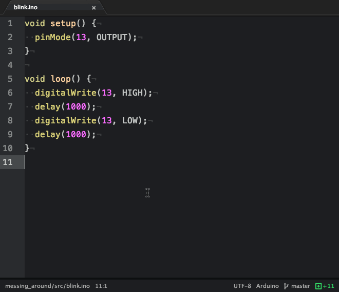

..  Copyright 2014-2015 Ivan Kravets <me@ikravets.com>
    Licensed under the Apache License, Version 2.0 (the "License");
    you may not use this file except in compliance with the License.
    You may obtain a copy of the License at
       http://www.apache.org/licenses/LICENSE-2.0
    Unless required by applicable law or agreed to in writing, software
    distributed under the License is distributed on an "AS IS" BASIS,
    WITHOUT WARRANTIES OR CONDITIONS OF ANY KIND, either express or implied.
    See the License for the specific language governing permissions and
    limitations under the License.

.. _ide_atom:

Atom
====

`Atom <https://atom.io>`_ is a text editor that's modern, approachable,
yet hackable to the core—a tool you can customize to do anything but also use
productively without ever touching a config file.

This software can be used with:

* all available :ref:`platforms`
* all available :ref:`frameworks`

Refer to the `Atom Documentation <https://atom.io/docs>`_
page for more detailed information.

.. contents::

Integration
-----------

Using `Atom Packages <https://atom.io/docs/v1.0.2/using-atom-atom-packages>`_
please install `platomformio <https://atom.io/packages/platomformio>`_ package.

Articles / Manuals
------------------

* `Arduino Development in Atom Editor <http://viget.com/extend/arduino-development-in-atom-editor>`_

See a full list with :ref:`articles`.

Screenshot
----------

Building
^^^^^^^^

Uploading
^^^^^^^^^

