..  Copyright 2014-2016 Ivan Kravets <me@ikravets.com>
    Licensed under the Apache License, Version 2.0 (the "License");
    you may not use this file except in compliance with the License.
    You may obtain a copy of the License at
       http://www.apache.org/licenses/LICENSE-2.0
    Unless required by applicable law or agreed to in writing, software
    distributed under the License is distributed on an "AS IS" BASIS,
    WITHOUT WARRANTIES OR CONDITIONS OF ANY KIND, either express or implied.
    See the License for the specific language governing permissions and
    limitations under the License.

.. _ide_atom:

PlatformIO IDE for Atom
=======================

PlatformIO IDE is the next-generation integrated development environment for IoT:

* Cross-platform build system without external dependencies to the OS software:

    - 250+ embedded boards
    - 20+ development platforms
    - 10+ frameworks

* C/C++ Intelligent Code Completion
* C/C++ Smart Code Linter for rapid professional development
* Library Manager for the hundreds popular libraries
* Multi-projects workflow with multiple panes
* Themes support with dark and light colors
* Serial Port Monitor
* Built-in Terminal with :ref:`PlatformIO CLI <userguide>` tool (``pio``, ``platformio``)

PlatformIO IDE is based on GitHub's `Atom <https://atom.io>`_ source
code editor that's modern, approachable, yet hackable to the core; a tool you
can customize to do anything but also use productively without ever touching a
config file.

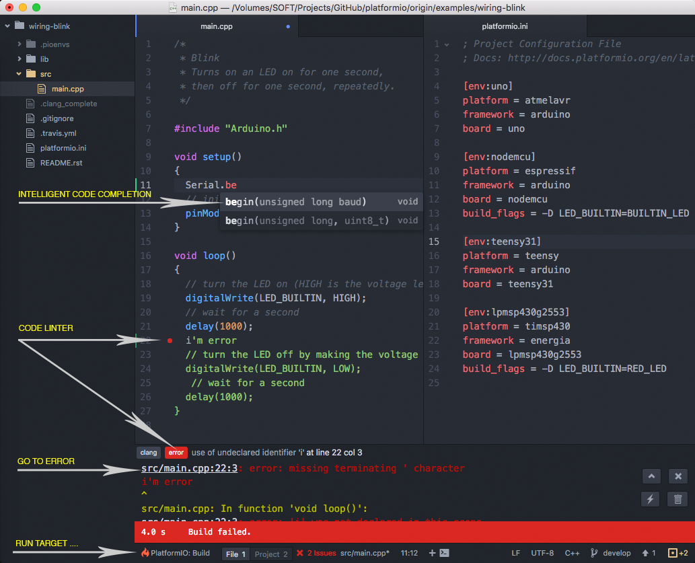

.. contents::

Installation
------------

PlatformIO IDE is the next-generation integrated development environment for IoT.
It's built on top of `GitHub's Atom "hackable" text editor <https://atom.io>`_.
If you have already Atom installed, please install `PlatformIO IDE for Atom package <https://atom.io/packages/platformio-ide>`_.

.. note::
    You don't need to install PlatformIO CLI seprately to system.
    PlatformIO CLI is built into PlatformIO IDE and you will be able to use it
    within PlatformIO IDE Terminal.

1. Python Interpreter
~~~~~~~~~~~~~~~~~~~~~

PlatformIO IDE is based on PlatformIO CLI which is written in
`Python <https://www.python.org/downloads/>`_. Python is installed by default
on the all popular OS except Windows.

**Windows Users**, please `Download the latest Python 2.7.x <https://www.python.org/downloads/>`_
and install it. **DON'T FORGET** to select ``Add python.exe to Path`` feature
on the "Customize" stage, otherwise ``python`` command will not be available.

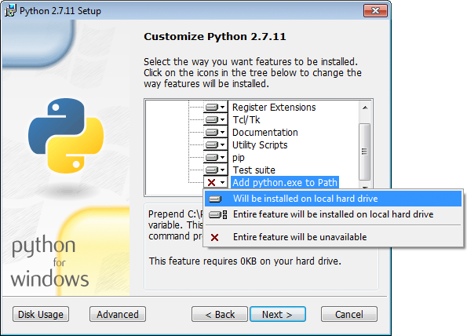

.. _ide_atom_installation_clang:

2. Clang for Intelligent Code Autocompletion
~~~~~~~~~~~~~~~~~~~~~~~~~~~~~~~~~~~~~~~~~~~~

PlatformIO IDE uses `clang <http://clang.llvm.org>`_ for the Intelligent Code
Autocompletion. To check that ``clang`` is available in your system, please
open Terminal and run ``clang --version``. If ``clang`` is not installed,
then install it and restart Atom:

- **Mac OS X**: `Install the latest Xcode <https://developer.apple.com/xcode/download/>`_
  along with the latest Command Line Tools
  (they are installed automatically when you run ``clang`` in Terminal for the
  first time, or manually by running ``xcode-select --install``
- **Windows**: Download the latest `Clang for Windows <http://llvm.org/releases/download.html>`_.
  Please select "Add LLVM to the system PATH" option on the installation step.

  .. image:: ../_static/clang-installer-add-path.png

  .. warning::
      If you see ``Failed to find MSBuild toolsets directory`` error in
      the installation console, please ignore it and press any key to close
      this window. PlatformIO IDE uses only Clang completion engine that
      should work after it without any problems.

- **Linux**: Using package managers: ``apt-get install clang`` or ``yum install clang``.
- **Other Systems**: Download the latest `Clang for the other systems <http://llvm.org/releases/download.html>`_.

.. warning::
    The libraries which are added/installed after initializing process will
    not be reflected in code linter. You need ``Menu: PlatformIO >
    Rebuild C/C++ Project Index (Autocomplete, Linter)``.

3. IDE Installation
~~~~~~~~~~~~~~~~~~~

.. note::
    If you don't have Atom installed yet, we propose to download
    `PlatformIO IDE for Atom bundle <http://platformio.org/platformio-ide>`_
    with built-in auto installer (optional).

- Download and install the `latest official Atom text editor <https://atom.io>`_.
- Open Atom Package Manager and install `platformio-ide <https://atom.io/packages/platformio-ide>`_
   Atom package (be patient and let the installation complete)

    - **Mac OS X**: ``Menu: Atom > Preferences > Install``
    - **Windows**: ``Menu: File > Settings > Install``
    - **Linux**: ``Menu: Edit > Preferences > Install``

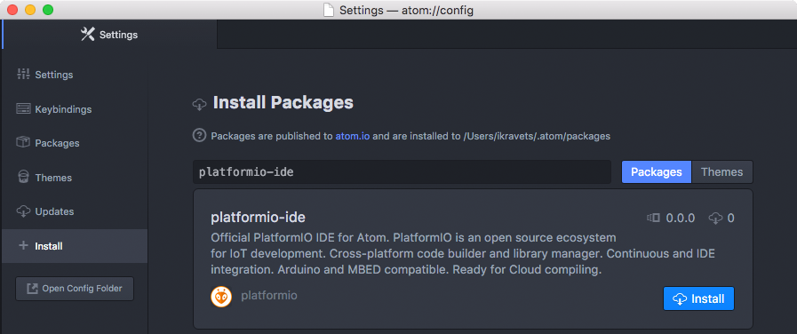

.. _atom_ide_quickstart:

Quick Start
-----------

This tutorial introduces you to the basics of PlatformIO IDE workflow and shows
you a creation process of a simple "Blink" example. After finishing you will
have a general understanding of how to work with projects in the IDE.

Launch
~~~~~~

After installation, you launch PlatformIO IDE by opening Atom. Once Atom is
open, PlatformIO IDE auto installer will continue to install dependent packages
and PlatformIO CLI. Please be patient and let the installation complete. In the
final result PlatformIO IDE will ask you to reload Atom window to apply
installed components. Please click on ``Reload Now``. After it PlatformIO IDE is
ready for using. Happy coding!

Setting Up the Project
~~~~~~~~~~~~~~~~~~~~~~

1. To create a new project choose
   ``Menu: PlatformIO > Initialize new Project or update existing`` or press
   the corresponding icon in the PlatformIO toolbar as shown in the image below:

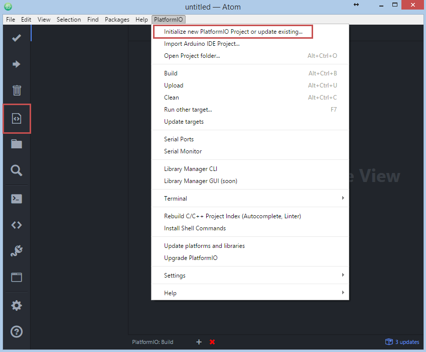

2. In the "New Project Menu" choose desired boards (more than one board is
   allowed) and select a project directory. Then press "Initialize" button:

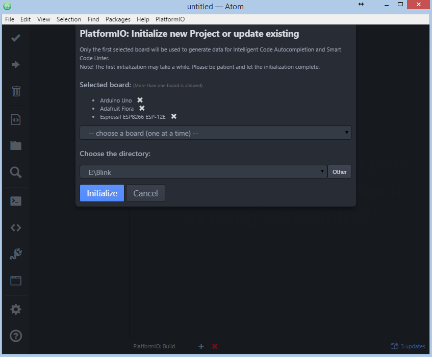

3. If everything is fine, you should see the success message and project tree
   in the left panel:

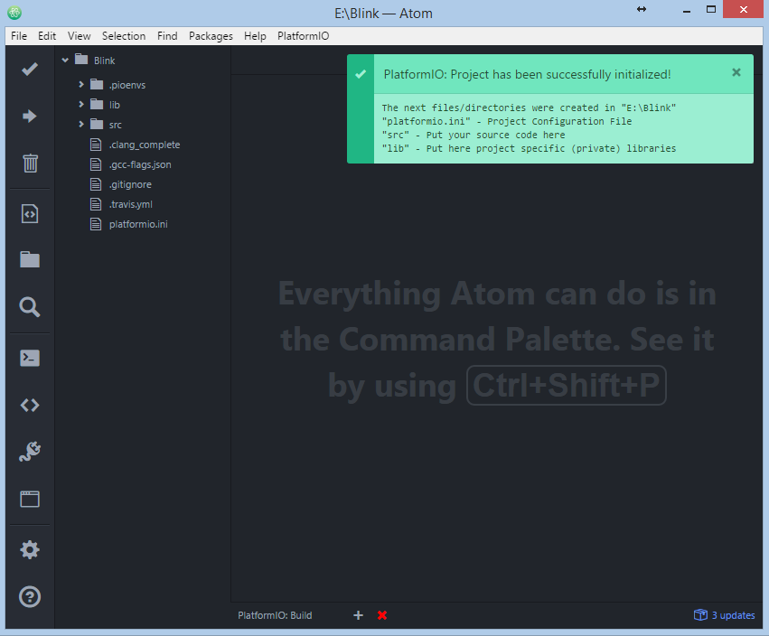

4. Now, let's create the first project source file: right-click on the folder
   ``src`` and choose ``New File``:

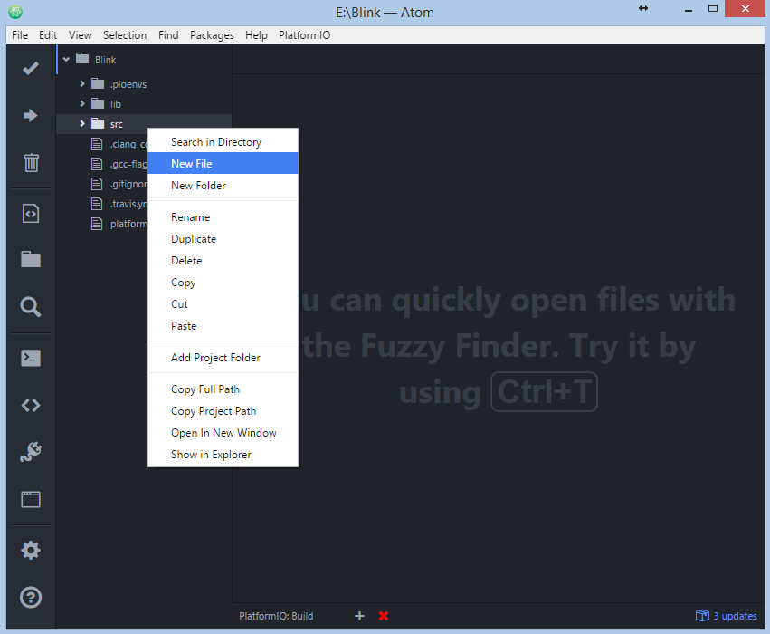

Enter filename ``main.cpp``:

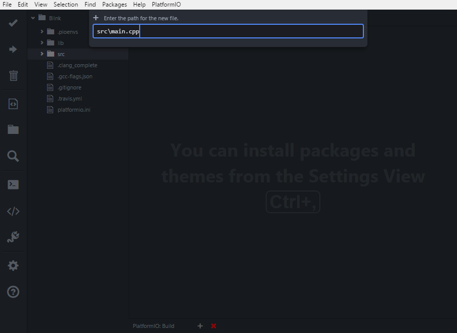

Copy the next source code to the just created file ``main.cpp``:

.. code-block:: cpp

    /**
     * Blink
     * Turns on an LED on for one second,
     * then off for one second, repeatedly.
     */
    #include "Arduino.h"

    void setup()
    {
      // initialize LED digital pin as an output.
      pinMode(LED_BUILTIN, OUTPUT);
    }

    void loop()
    {
      // turn the LED on (HIGH is the voltage level)
      digitalWrite(LED_BUILTIN, HIGH);
      // wait for a second
      delay(1000);
      // turn the LED off by making the voltage LOW
      digitalWrite(LED_BUILTIN, LOW);
       // wait for a second
      delay(1000);
    }

Process Project
~~~~~~~~~~~~~~~

PlatformIO IDE proposes different ways to process project (build, clean,
upload firmware, run other targets) using:

    - :ref:`atom_ide_platformio_toolbar`
    - :ref:`atom_ide_platformio_menu`
    - :ref:`ide_atom_building_targets` and hotkeys

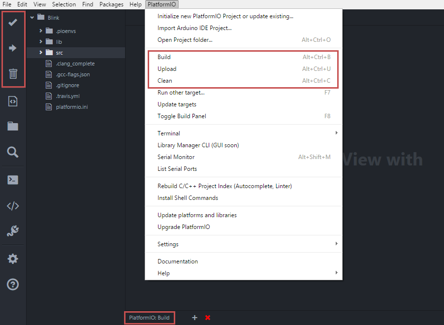

5. Run ``Build`` and you should see green "success" result in the building
   panel:

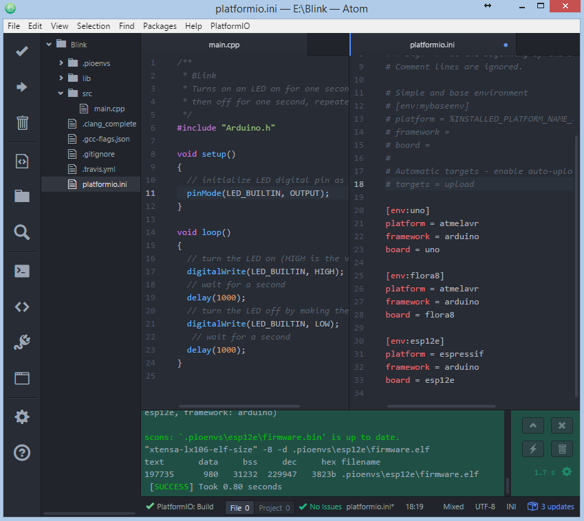

To upload firmware to the board run ``Upload``.

6. What is more, you can run specific target or process project environment
   using ``Menu: PlatformIO > Run other target...``
   or call targets list from the status bar (bottom, left corner):

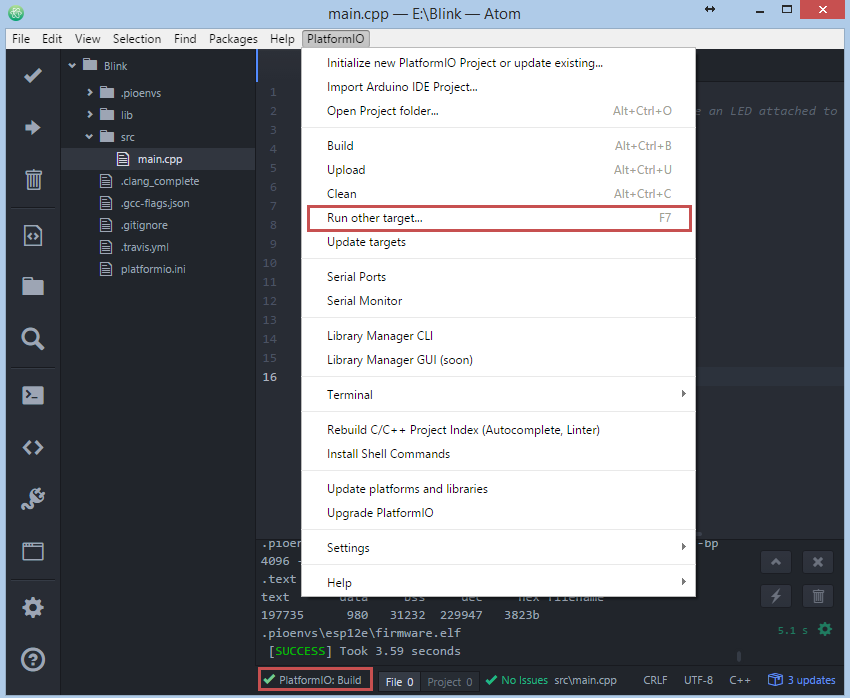

And select desired target:

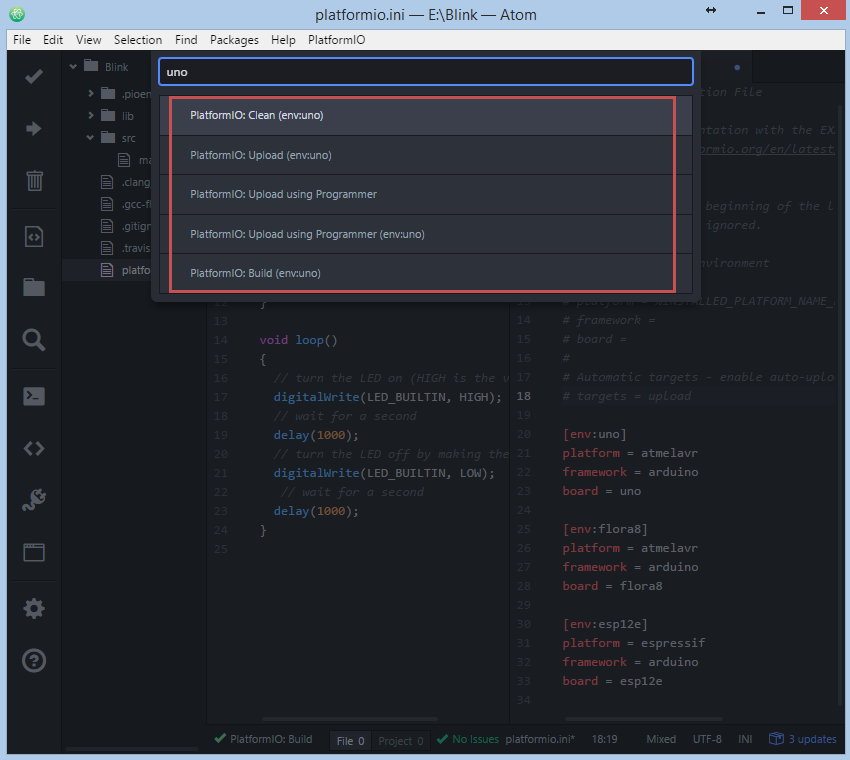

7. To run built-in terminal interface choose ``Menu: PlatformIO > Terminal`` or
   press the corresponding icon in the PlatformIO toolbar:

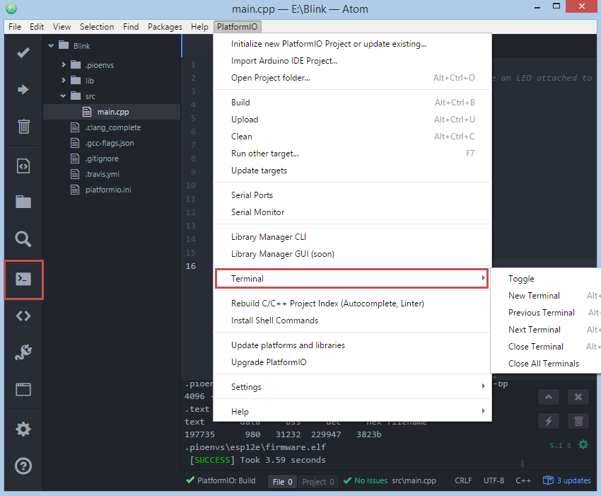

It provides you fast access to all set of powerful PlatformIO CLI commands:

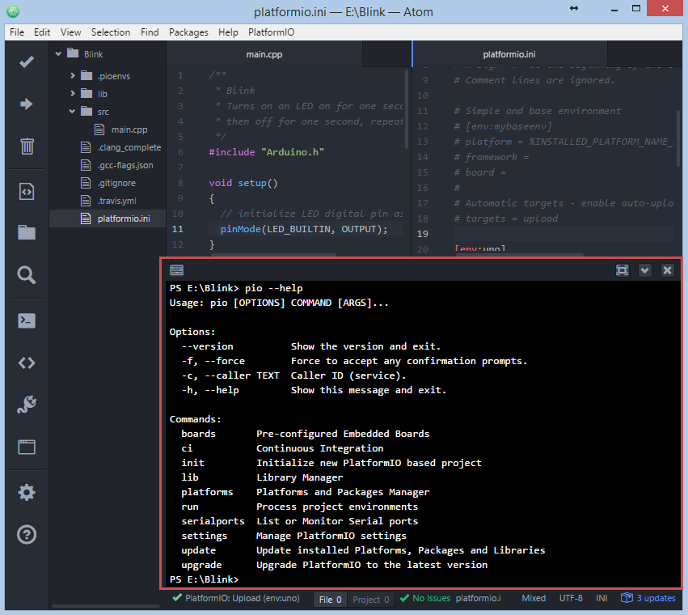

8. To run built-in "Serial Monitor" choose ``Menu: PlatformIO > Serial Monitor``
   or press the corresponding icon in the PlatformIO toolbar:

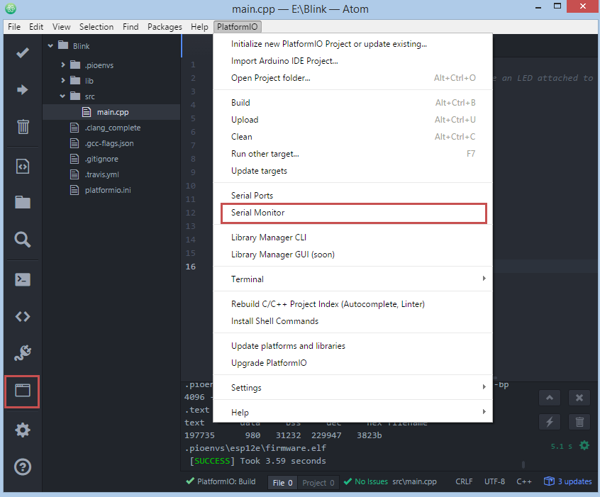

It has several settings to adjust your connection:

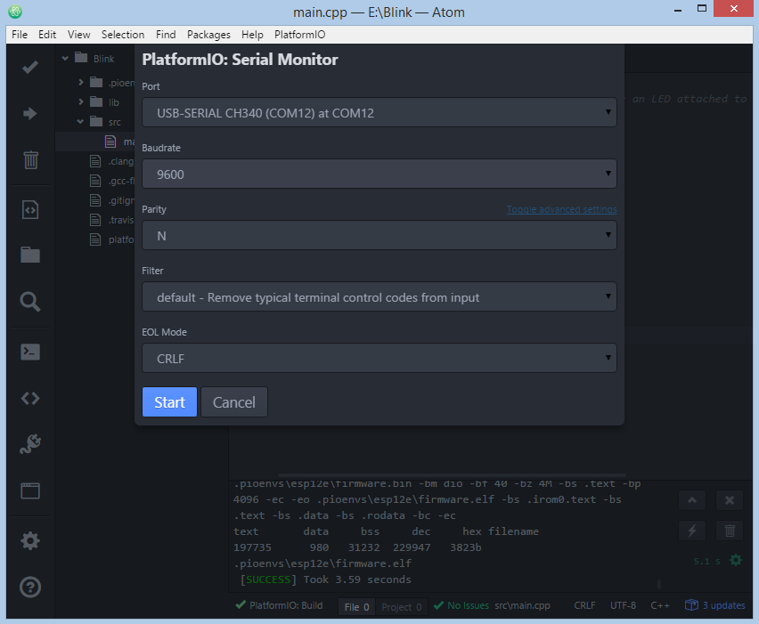

And allows you to communicate with your board in an easy way:

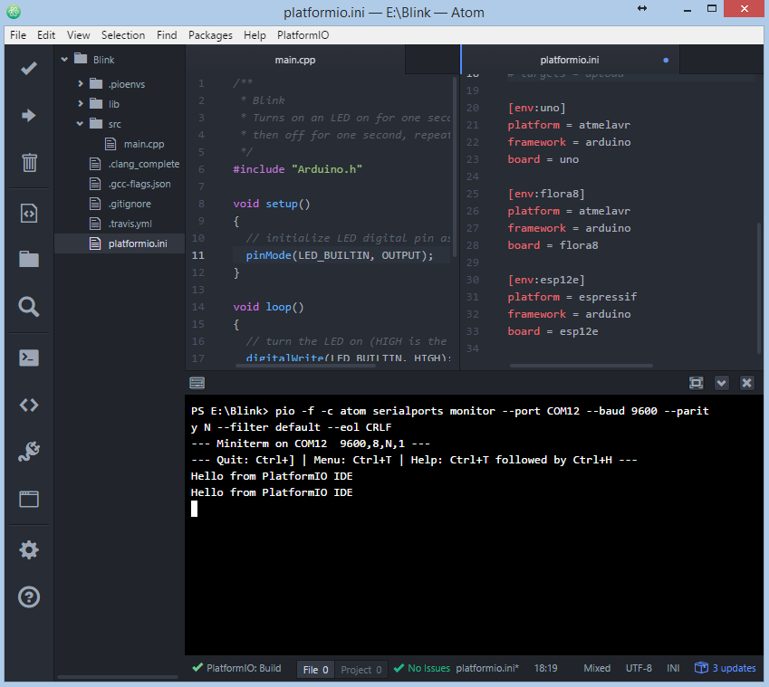

User Guide
----------

.. _atom_ide_platformio_menu:

Menu item ``PlatformIO``
~~~~~~~~~~~~~~~~~~~~~~~~

`platformio-ide <https://atom.io/packages/platformio-ide>`_ package adds to Atom
new menu item named ``Menu: PlatformIO`` (after ``Menu: Help`` item).

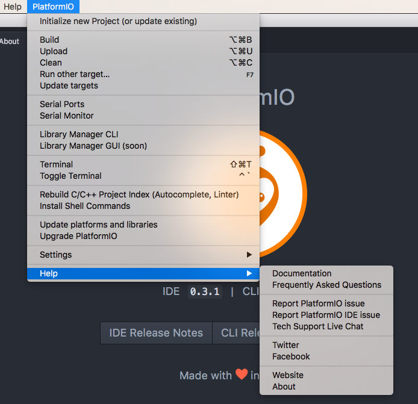

.. _atom_ide_platformio_toolbar:

PlatformIO Toolbar
~~~~~~~~~~~~~~~~~~

PlatformIO IDE Toolbar contains the quick access button to the popular commands.
Each button contains hint (delay mouse on it).

.. image:: ../_static/ide-atom-platformio-toolbar.png

* PlatformIO: Build
* PlatformIO: Upload
* PlatformIO: Clean
* ||
* Initialize new PlatformIO Project or update existing...
* Add/Open Project Folder...
* Find in Project...
* ||
* Terminal
* Library Manager
* Serial Monitor
* ||
* Settings
* PlatformIO Documentation

.. _ide_atom_building_targets:

Building / Uploading / Targets
~~~~~~~~~~~~~~~~~~~~~~~~~~~~~~

* ``cmd-alt-b`` / ``ctrl-alt-b`` / ``f9`` builds project without auto-uploading.
* ``cmd-alt-u`` / ``ctrl-alt-u`` builds and uploads (if no errors).
* ``cmd-alt-c`` / ``ctrl-alt-c`` cleans compiled objects.
* ``cmd-alt-t`` / ``ctrl-alt-t`` / ``f7`` run other targets (Upload using Programmer, Upload SPIFFS image, Update platforms and libraries).
* ``cmd-alt-g`` / ``ctrl-alt-g`` / ``f4`` cycles through causes of build error.
* ``cmd-alt-h`` / ``ctrl-alt-h`` / ``shift-f4`` goes to the first build error.
* ``cmd-alt-v`` / ``ctrl-alt-v`` / ``f8`` toggles the build panel.
* ``escape`` terminates build / closes the build window.

More options ``Menu: PlatformIO > Settings > Build``.

Intelligent Code Autocompletion
~~~~~~~~~~~~~~~~~~~~~~~~~~~~~~~

PlatformIO IDE uses `clang <http://clang.llvm.org>`_ for the Intelligent Code Autocompletion.
To install it or check if it is already installed, please follow to step
:ref:`ide_atom_installation_clang` from Installation guide.

.. warning::
    The libraries which are added/installed after initializing process will
    not be reflected in code linter. You need ``Menu: PlatformIO >
    Rebuild C/C++ Project Index (Autocomplete, Linter)``.

.. _ide_atom_smart_code_linter:

Smart Code Linter
~~~~~~~~~~~~~~~~~

PlatformIO IDE uses PlatformIO's pre-built GCC toolchains for Smart Code Linter
and rapid professional development.
The configuration data are located in ``.gcc-flags.json``. This file will be
automatically created and preconfigured when you initialize project using
``Menu: PlatformIO > Initialize new PlatformIO Project or update existing...``.

.. warning::
    The libraries which are added/installed after initializing process will
    not be reflected in code linter. You need ``Menu: PlatformIO >
    Rebuild C/C++ Project Index (Autocomplete, Linter)``.

.. error::
    If you have error like ``linter-gcc: Executable not found`` and
    ``"***/.platformio/packages/toolchain-atmelavr/bin/avr-g++" not found``
    please ``Menu: PlatformIO > Initialize new PlatformIO Project or update existing...``.

Install Shell Commands
~~~~~~~~~~~~~~~~~~~~~~

To install ``platformio`` and ``pio`` shell commands please use ``Menu:
PlatformIO > Install Shell Commands``. It will allow you to call PlatformIO from
other process, terminal and etc.

Known issues
------------

Smart Code Linter is disabled for Arduino files
~~~~~~~~~~~~~~~~~~~~~~~~~~~~~~~~~~~~~~~~~~~~~~~

:ref:`ide_atom_smart_code_linter` is disabled by default for Arduino files
(``*.ino`` and ``.pde``) because they  are not valid C/C++ based
source files:

1. Missing includes such as ``#include <Arduino.h>``
2. Function declarations are omitted.

There are two solutions:

.. contents::
    :local:

.. _ide_atom_knownissues_sclarduino_manually:

Convert Arduino file to C++ manually
^^^^^^^^^^^^^^^^^^^^^^^^^^^^^^^^^^^^

For example, we have the next ``Demo.ino`` file:

.. code-block:: cpp

    void function setup () {
        someFunction(13);
    }

    void function loop() {
        delay(1000);
    }

    void someFunction(int num) {
    }

Let's convert it to  ``Demo.cpp``:

1. Add ``#include <Arduino.h>`` at the top of the source file
2. Declare each custom function (excluding built-in, such as ``setup`` and ``loop``)
   before it will be called.

The final ``Demo.cpp``:

.. code-block:: cpp

    #include <Arduino.h>

    void someFunction(int num);

    void function setup () {
        someFunction(13);
    }

    void function loop() {
        delay(1000);
    }

    void someFunction(int num) {
    }

Force Arduino file as C++
^^^^^^^^^^^^^^^^^^^^^^^^^

To force Smart Code Linter to use Arduino files as C++ please

1. Open ``.gcc-flags.json`` file from the Initialized/Imported project and add
   ``-x c++`` flag at the beginning of the value of ``gccDefaultCppFlags`` field:

.. code-block:: json

    {
      "execPath": "...",
      "gccDefaultCFlags": "...",
      "gccDefaultCppFlags": "-x c++ -fsyntax-only ...",
      "gccErrorLimit": 15,
      "gccIncludePaths": "...",
      "gccSuppressWarnings": false
    }

2. Perform all steps from :ref:`ide_atom_knownissues_sclarduino_manually`
   (without renaming to ``.cpp``).

.. _ide_atom_faq:

Frequently Asked Questions
--------------------------

Keep build panel visible
~~~~~~~~~~~~~~~~~~~~~~~~

PlatformIO IDE hides build panel on success by default. Nevertheless, you can
keep it visible all time. Please follow to
``Menu: PlatformIO > Settings > Build`` and set ``Panel Visibility`` to
``Keep Visible``.

Key-bindings (toggle panel):

* ``cmd+alt+v`` - Mac OS X
* ``ctrl+alt+v`` - Windows/Linux

Automatically save on build
~~~~~~~~~~~~~~~~~~~~~~~~~~~

If you want automatically save all edited files when triggering a build, please follow to
``Menu: PlatformIO > Settings > Build`` and check ``Automatically save on build``.

Jump to Declaration
~~~~~~~~~~~~~~~~~~~

Click on a function/include, press ``F3`` and you will be taken directly to
the declaration for that function.

Code Formatting
~~~~~~~~~~~~~~~

You need to install `atom-beautify <https://atom.io/packages/atom-beautify>`_
package and `C/C++ Uncrustify Code Beautifier <http://sourceforge.net/projects/uncrustify/>`_.

Articles / Manuals
------------------

* May 30, 2016 - **Ron Moerman** - `IoT Development with PlatformIO <https://electronicsworkbench.io/blog/platformio>`_
* May 01, 2016 - **Pedro Minatel** - `PlatformIO – Uma alternativa ao Arduino IDE (PlatformIO - An alternative to the Arduino IDE, Portuguese) <http://pedrominatel.com.br/ferramentas/platformio-uma-alternativa-ao-arduino-ide/>`_
* Apr 23, 2016 - **Al Williams** - `Hackaday: Atomic Arduino (and Other) Development <http://hackaday.com/2016/04/23/atomic-arduino-and-other-development/>`_
* Apr 16, 2016 - **Sathittham Sangthong** - `[PlatformIO] มาลองเล่น PlatformIO แทน Arduino IDE กัน (Let's play together with PlatformIO IDE [alternative to Arduino IDE], Thai) <http://www.sathittham.com/platformio/platformio-ide/>`_
* Apr 11, 2016 - **Matjaz Trcek** - `Top 5 Arduino integrated development environments <https://codeandunicorns.com/top-5-arduino-integrated-development-environments-ide/>`_
* Apr 06, 2016 - **Aleks** - `PlatformIO ausprobiert (Tried PlatformIO, German) <http://5volt-junkie.net/platformio/>`_
* Apr 02, 2016 - **Diego Pinto** - `Você tem coragem de abandonar a IDE do Arduino? PlatformIO + Atom (Do you dare to leave the Arduino IDE? PlatformIO + Atom, Portuguese) <http://www.clubemaker.com.br/?rota=artigo/81>`_
* Mar 30, 2016 - **Brandon Cannaday** - `Getting Started with PlatformIO and ESP8266 NodeMcu <https://www.getstructure.io/blog/getting-started-with-platformio-esp8266-nodemcu>`_
* Mar 12, 2016 - **Peter Marks** - `PlatformIO, the Arduino IDE for programmers <http://blog.marxy.org/2016/03/platformio-arduino-ide-for-programmers.html>`_
* Mar 05, 2016 - **brichacek.net** - `PlatformIO – otevřený ekosystém pro vývoj IoT (PlatformIO – an open source ecosystem for IoT development, Czech) <http://blog.brichacek.net/platformio-otevreny-ekosystem-pro-vyvoj-iot/>`_
* Mar 04, 2016 - **Ricardo Vega** - `Programa tu Arduino desde Atom (Program your Arduino from Atom, Spanish) <http://ricveal.com/blog/programa-arduino-desde-atom/>`_
* Feb 28, 2016 - **Alex Bloggt** - `PlatformIO vorgestellt (Introduction to PlatformIO IDE, German) <https://alexbloggt.com/platformio-vorgestellt/>`_
* Feb 25, 2016 - **NutDIY** - `PlatformIO Blink On Nodemcu Dev Kit V1.0 (Thai) <http://nutdiy.blogspot.com/2016/02/platformio-blink-on-nodemcu-dev-kit-v10.html>`_

See a full list with :ref:`articles`.
