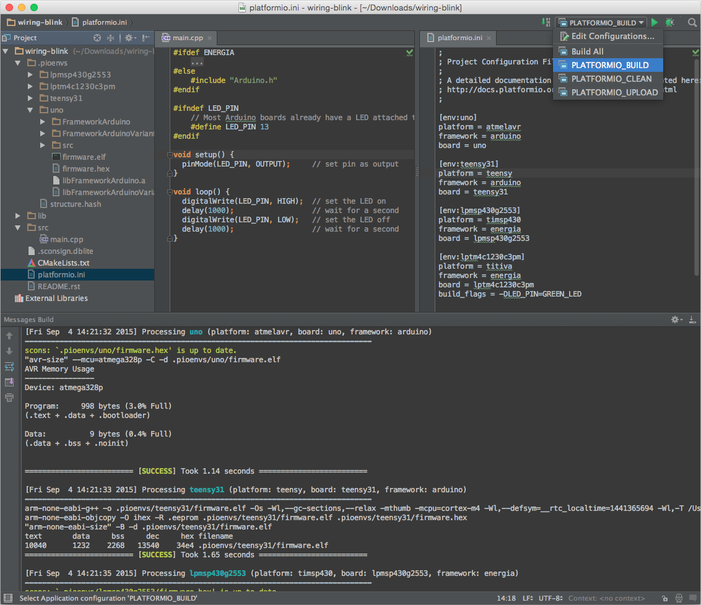

..  Copyright 2014-2016 Ivan Kravets <me@ikravets.com>
    Licensed under the Apache License, Version 2.0 (the "License");
    you may not use this file except in compliance with the License.
    You may obtain a copy of the License at
       http://www.apache.org/licenses/LICENSE-2.0
    Unless required by applicable law or agreed to in writing, software
    distributed under the License is distributed on an "AS IS" BASIS,
    WITHOUT WARRANTIES OR CONDITIONS OF ANY KIND, either express or implied.
    See the License for the specific language governing permissions and
    limitations under the License.

.. _ide_clion:

CLion
=====

The `CLion <https://www.jetbrains.com/clion/>`_ is a cross-platform C/C++ IDE
for Linux, OS X, and Windows integrated with the CMake build system. The
initial version will support the GCC and Clang compilers and GDB debugger.
Clion includes such features as a smart editor, code quality assurance,
automated refactorings, project manager, integrated version control systems.

Refer to the `CLion Documentation <https://www.jetbrains.com/clion/documentation/>`_
page for more detailed information.

.. contents::

Integration
-----------

Choose board ``type`` using :ref:`cmd_boards` or `Embedded Boards Explorer <http://platformio.org/boards>`_
command and generate project via :option:`platformio init --ide` command:

.. code-block:: shell

    platformio init --ide clion --board %TYPE%

    # For example, generate project for Arduino UNO
    platformio init --ide clion --board uno

Then:

1. Place source files (``*.c, *.cpp, *.h, *.hpp``) to ``src`` directory
2. Import this project via ``Menu: File > Import Project``
   and specify root directory where is located :ref:`projectconf`
3. Open source file from ``src`` directory
4. Build project (*DO NOT RUN*): ``Menu: Run > Build``.

.. warning::

    See know issue: :ref:`ide_clion_knownissues_inopde_not_supported` and how
    to resolve it.

There are 6 predefined targets for building (*NOT FOR RUNNING*, see marks on
the screenshot below):

* ``PLATFORMIO_BUILD`` - Build project without auto-uploading
* ``PLATFORMIO_UPLOAD`` - Build and upload (if no errors)
* ``PLATFORMIO_CLEAN`` - Clean compiled objects
* ``PLATFORMIO_PROGRAM`` - Build and upload using external programmer
  (if no errors), see :ref:`atmelavr_upload_via_programmer`
* ``PLATFORMIO_UPLOADFS`` - Upload files to file system SPIFFS,
  see :ref:`platform_espressif_uploadfs`
* ``PLATFORMIO_UPDATE`` - Update installed platforms and libraries via :ref:`cmd_update`
* ``PLATFORMIO_REBUILD_PROJECT_INDEX`` - Rebuild C/C++ Index for the Project.
  Allows to fix code completion and code linting issues.

.. warning::
    The libraries which are added, installed or used in the project
    after generating process wont be reflected in IDE. To fix it please run
    ``PLATFORMIO_REBUILD_PROJECT_INDEX`` target.

Known issues
------------

.. _ide_clion_knownissues_inopde_not_supported:

Arduino ``.ino`` files are not supported
~~~~~~~~~~~~~~~~~~~~~~~~~~~~~~~~~~~~~~~~

CLion uses "CMake" tool for code completion and code linting. As result, it
doesn't support Arduino files (``*.ino`` and ``.pde``) because they are
not valid C/C++ based source files:

1. Missing includes such as ``#include <Arduino.h>``
2. Function declarations are omitted.

Convert Arduino file to C++ manually
^^^^^^^^^^^^^^^^^^^^^^^^^^^^^^^^^^^^

For example, we have the next ``Demo.ino`` file:

.. code-block:: cpp

    void function setup () {
        someFunction(13);
    }

    void function loop() {
        delay(1000);
    }

    void someFunction(int num) {
    }

Let's convert it to  ``Demo.cpp``:

1. Add ``#include <Arduino.h>`` at the top of the source file
2. Declare each custom function (excluding built-in, such as ``setup`` and ``loop``)
   before it will be called.

The final ``Demo.cpp``:

.. code-block:: cpp

    #include <Arduino.h>

    void someFunction(int num);

    void function setup () {
        someFunction(13);
    }

    void function loop() {
        delay(1000);
    }

    void someFunction(int num) {
    }

Articles / Manuals
------------------

* Dec 01, 2015 - **JetBrains CLion Blog** - `C++ Annotated: Fall 2015. Arduino Support in CLion using PlatformIO <http://blog.jetbrains.com/clion/2015/12/cpp-annotated-fall-2015/>`_
* Nov 22, 2015 - **Michał Seroczyński** - `Using PlatformIO to get started with Arduino in CLion IDE <http://www.ches.pl/using-platformio-get-started-arduino-clion-ide/>`_
* Nov 09, 2015 - **ÁLvaro García Gómez** - `Programar con Arduino "The good way" (Programming with Arduino "The good way", Spanish) <http://congdegnu.es/2015/11/09/programar-con-arduino-the-good-way/>`_

See more :ref:`articles`.

Examples
--------

"Blink" Project
~~~~~~~~~~~~~~~

Source code of `CLion "Blink" Project <https://github.com/platformio/platformio-examples/tree/develop/ide/clion>`_.
