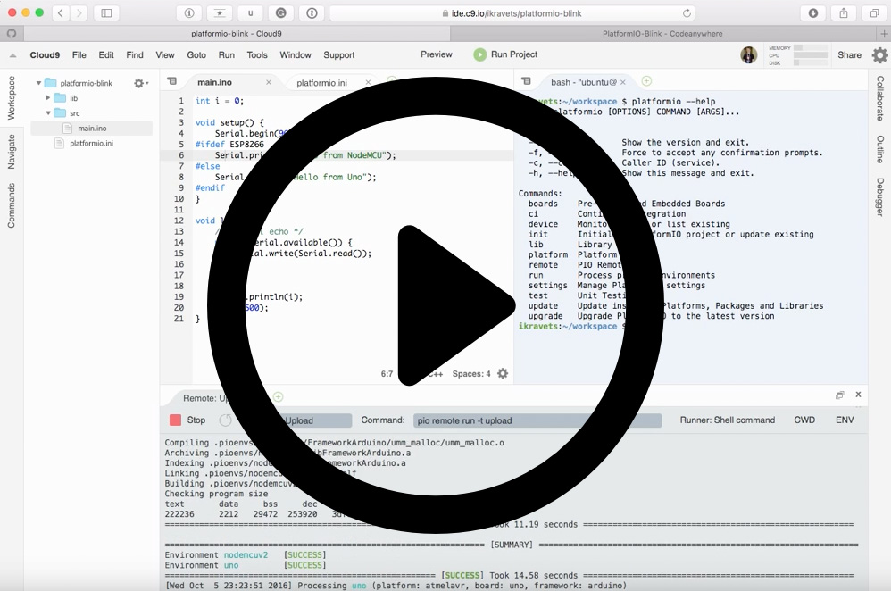
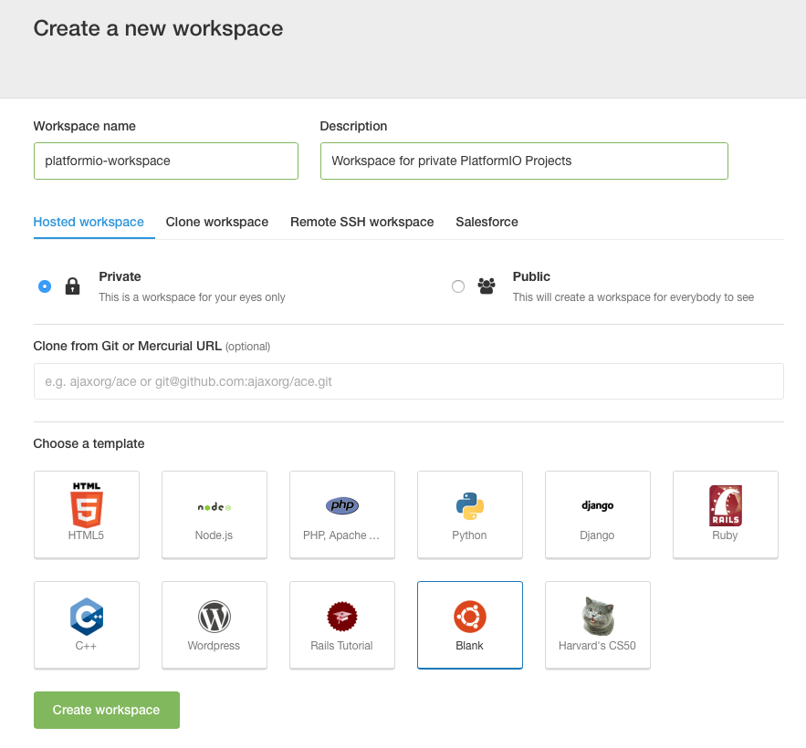
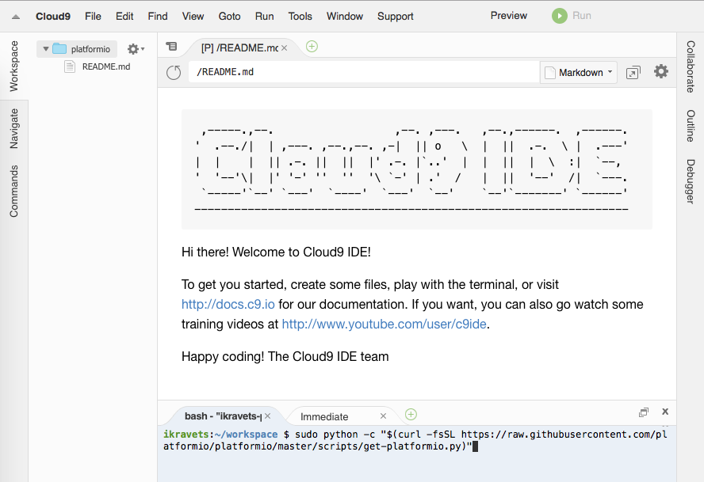
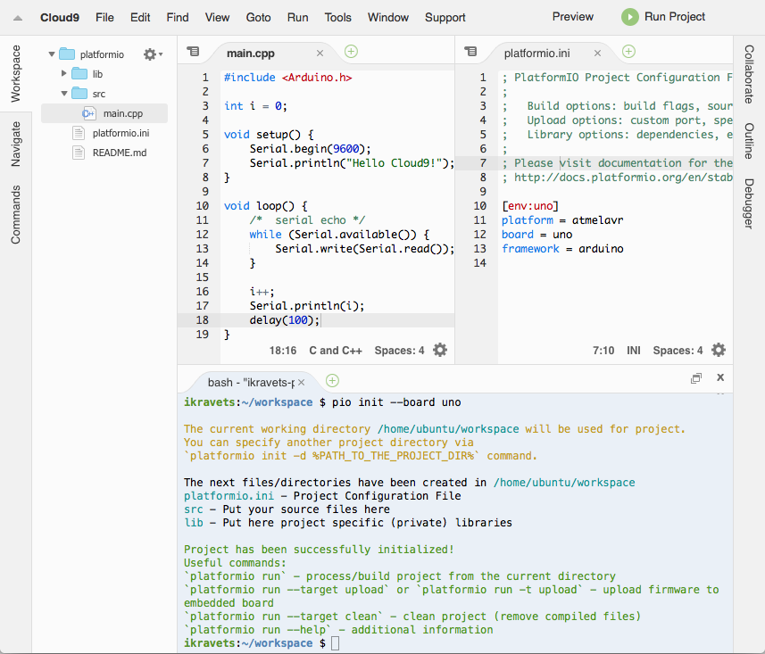
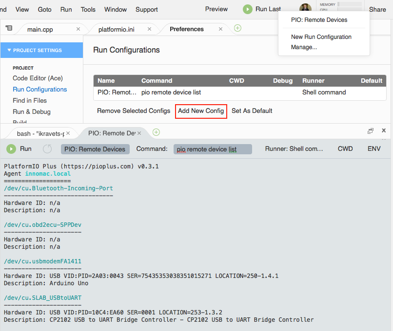
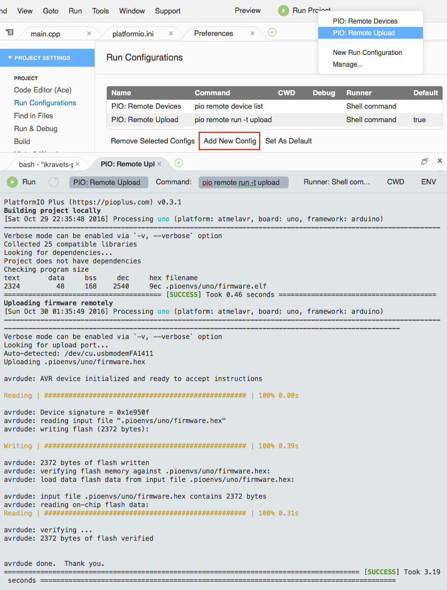
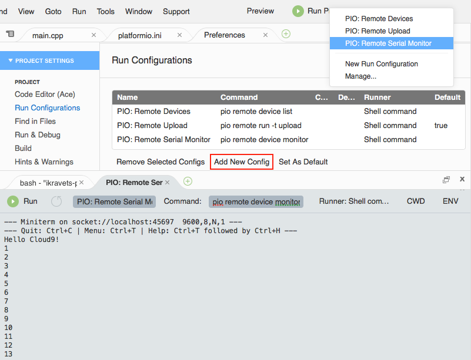

..  Copyright 2014-present PlatformIO <contact@platformio.org>
    Licensed under the Apache License, Version 2.0 (the "License");
    you may not use this file except in compliance with the License.
    You may obtain a copy of the License at
       http://www.apache.org/licenses/LICENSE-2.0
    Unless required by applicable law or agreed to in writing, software
    distributed under the License is distributed on an "AS IS" BASIS,
    WITHOUT WARRANTIES OR CONDITIONS OF ANY KIND, either express or implied.
    See the License for the specific language governing permissions and
    limitations under the License.

.. _ide_cloud9:

Cloud9
======

`Cloud9 <https://c9.io/>`_ combines a powerful online code editor with a full
Ubuntu workspace in the cloud.
Workspaces are powered by Docker Ubuntu containers that give you full freedom
over your environment, including sudo rights. Do a git push, compile SASS, see
server output, and Run apps easily with the built-in Terminal and Runners.

.. contents::

.. note::

    1. Please make sure to read :ref:`pio_remote` guide first.
    2. You need :ref:`cmd_account` if you don't have it. Registration is FREE.
    3. You should have a run :ref:`cmd_remote_agent` on a local host machine
       where hardware devices are connected or visible for remote operations.

Demo
----

Integration
-----------

1.  `Sign in to Cloud9 <https://c9.io/dashboard.html>`_. A registration is FREE
    and gives you for FREE 1 private workspace (where you can host multiple
    PlatformIO Projects) and unlimited public workspaces.

2.  Create a new workspace using **Blank** template

3. Install PlatformIO CLI using Cloud IDE Terminal. Paste a next command

.. code-block:: bash

        sudo python -c "$(curl -fsSL https://raw.githubusercontent.com/platformio/platformio/develop/scripts/get-platformio.py)"

4.  Log in to :ref:`cmd_account` using :ref:`cmd_account_login` command.

Quick Start
-----------

Let's create our first PlatformIO-based Cloud9 Project

1.  Initialize new PlatformIO-based Project. Run a next command in Cloud IDE
    Terminal:

.. code-block:: bash

    platformio init --board <ID>

    # initialize project for Arduino Uno
    platformio init --board uno

    To get board ``ID`` please use :ref:`cmd_boards` command or
    `Embedded Boards Explorer <http://platformio.org/boards>`_.

2.  Create new source file named ``main.cpp`` in ``src`` folder using
    Project Tree (left side). Please make right click on ``src`` folder,
    then "New File" and insert a next content:

.. code-block:: c

    #include <Arduino.h>

    int i = 0;

    void setup() {
        Serial.begin(9600);
        Serial.println("Hello Cloud9!");
    }

    void loop() {
        /*  serial echo */
        while (Serial.available()) {
            Serial.write(Serial.read());
        }

        i++;
        Serial.println(i);
        delay(100);
    }

3.  If you prefer to work with PlatformIO CLI, then you can process project
    using Cloud IDE Terminal and the next commands:

    * :ref:`cmd_run` - build project
    * :ref:`pio run -t clean <cmd_run>` - clean project
    * :ref:`pio remote run -t upload <cmd_remote_run>` - upload firmware Over-The-Air

    If you are interested in better integration with Cloud9 and GUI, please
    read guide below where we will explain how to create custom Build System
    for PlatformIO and own Runners.

PlatformIO Build System
-----------------------

Cloud9 allows to create own build system and use hotkey or command
(Menu: Run > Build) to build a project.

Let's create PlatformIO Build System that will be used for C/C++/H/INO/PDE
files by default. Please click on ``Menu: Run > Build System > New Build System``
and replace all content with the next:

.. code-block:: js

    {
        "cmd" : ["pio", "run", "-d", "$file"],
        "info" : "Building $project_path/$file_name",
        "selector": "^.*\\.(cpp|c|h|hpp|S|ini|ino|pde)$"
    }

Save new Build System and give a name ``PIOBuilder``. Now, you can select it
as default Build System using ``Menu: Run > Build System > PIOBuilder``.

OTA Device Manager
------------------

Over-The-Air (OTA) Device Manager works in pair with :ref:`pio_remote`.
You can list remote devices that are connected to host machine where
:ref:`pio_remote_agent` is started or are visible for it.
To list active agents please use this command :ref:`cmd_remote_agent_list`.

Let's create New Run Configuration (shortcut) that will be used for OTA Manager.
Please click on ``Menu: Run > Run Configurations > Manage...``, then
"Add New Config" and specify the next values:

* **First Blank Input**: a name of runner. Please set it to "PIO: Remote Devices"
* **Command**: set to ``pio remote device list``
* **Runner**: set to "Shell command"

OTA Firmware Uploading
----------------------

Over-The-Air (OTA) Firmware Uploading works in pair with :ref:`pio_remote`.
You can deploy firmware to any devices which are visible for :ref:`pio_remote_agent`.
To list active agents please use this command :ref:`cmd_remote_agent_list`.

Let's create New Run Configuration (shortcut) that will be used for OTA Uploads.
Please click on ``Menu: Run > Run Configurations > Manage...``, then
"Add New Config" and specify the next values:

* **First Blank Input**: a name of runner. Please set it to "PIO: Remote Upload"
* **Command**: set to ``pio remote run -t upload``
* **Runner**: set to "Shell command"

OTA Serial Port Monitor
-----------------------

Over-The-Air (OTA) Serial Port Monitor works in pair with :ref:`pio_remote`.
You can read or send data to any device that is connected to host machine
where :ref:`pio_remote_agent` is started.
To list active agents please use this command :ref:`cmd_remote_agent_list`.

Let's create New Run Configuration (shortcut) that will be used for OTA Serial Port Monitor.
Please click on ``Menu: Run > Run Configurations > Manage...``, then
"Add New Config" and specify the next values:

* **First Blank Input**: a name of runner. Please set it to "PIO: Remote Serial Monitor"
* **Command**: set to ``pio remote device monitor``
* **Runner**: set to "Shell command"

