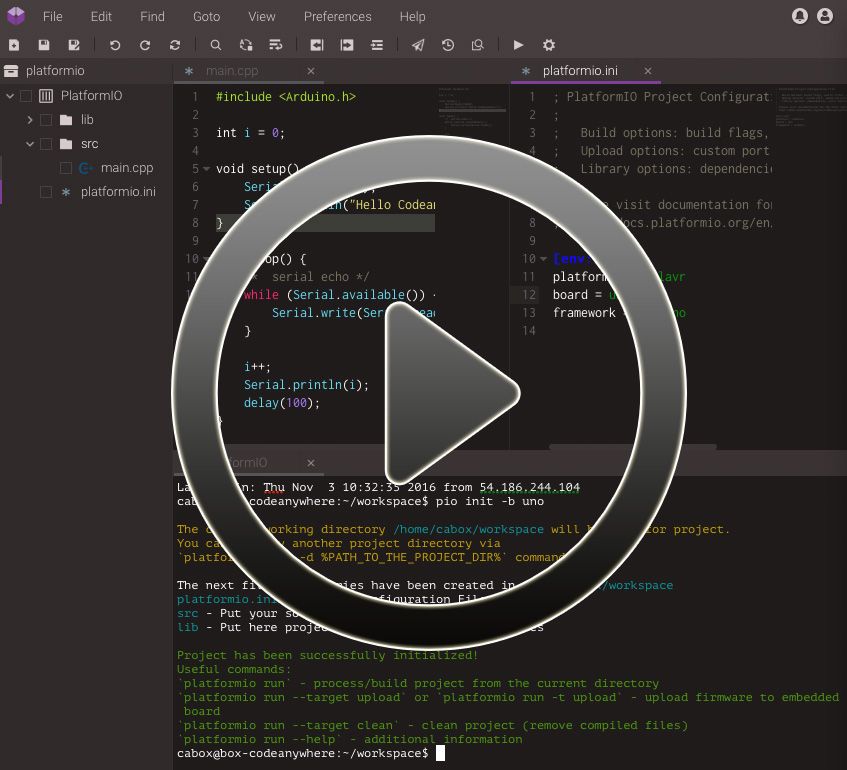
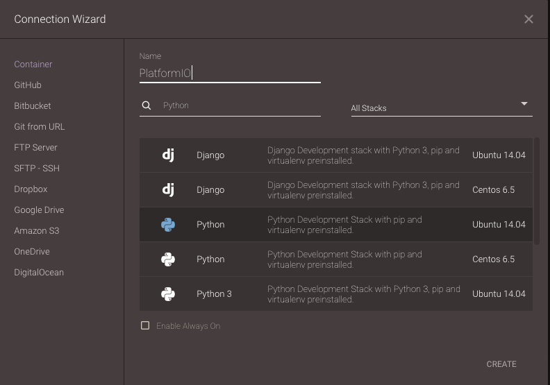
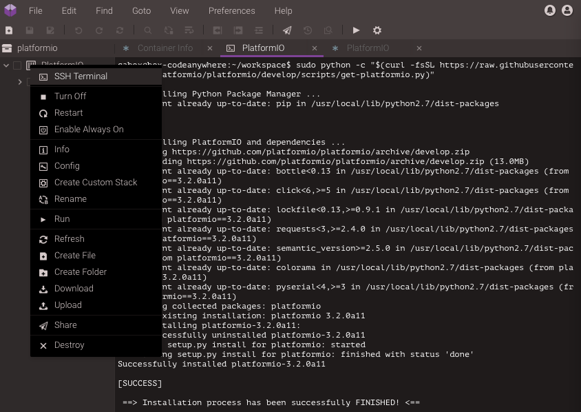
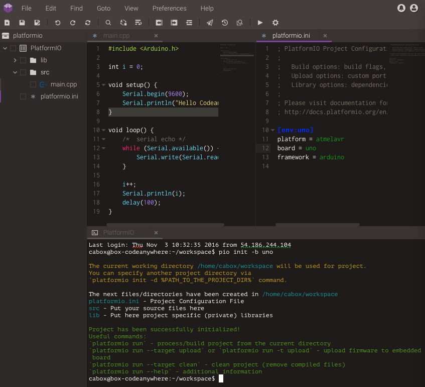
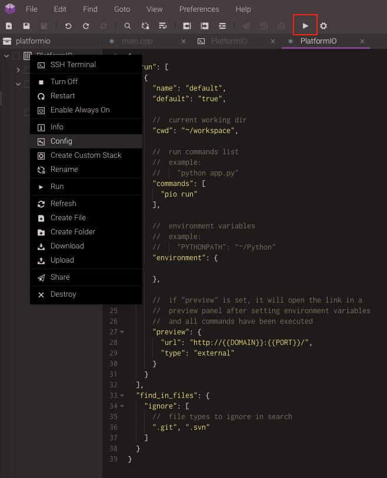
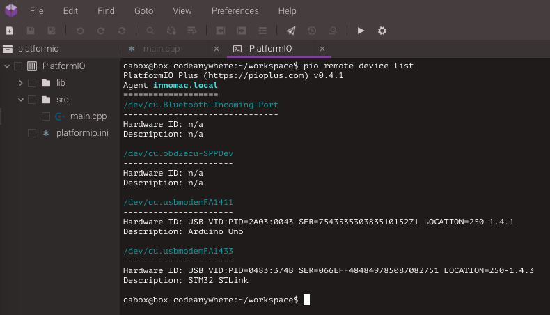
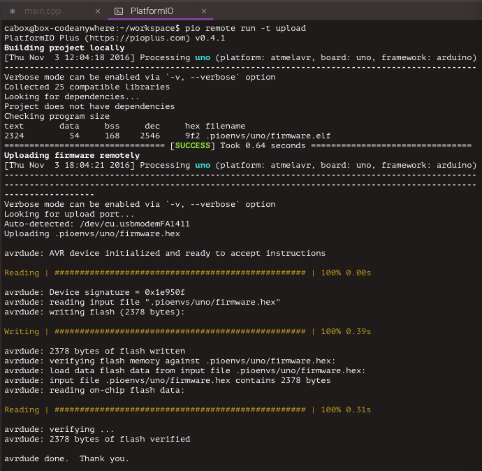

..  Copyright 2014-present PlatformIO <contact@platformio.org>
    Licensed under the Apache License, Version 2.0 (the "License");
    you may not use this file except in compliance with the License.
    You may obtain a copy of the License at
       http://www.apache.org/licenses/LICENSE-2.0
    Unless required by applicable law or agreed to in writing, software
    distributed under the License is distributed on an "AS IS" BASIS,
    WITHOUT WARRANTIES OR CONDITIONS OF ANY KIND, either express or implied.
    See the License for the specific language governing permissions and
    limitations under the License.

.. _ide_codeanywhere:

Codeanywhere
============

`Codeanywhere <https://codeanywhere.com>`_ is a Cross Platform Cloud IDE and
it has all the features of Desktop IDE but with additional features only a
cloud application can give you! Codeanywhere is very flexible and you can set
up your workflow any way you want it. The elegant development environment
will let you focus on building great applications quicker. All the features
you will need for any coding task are built into Codeanywhere, making
development more productive and fun.

.. contents::

.. note::

    1. Please make sure to read :ref:`pio_remote` guide first.
    2. You need :ref:`cmd_account` if you don't have it. Registration is FREE.
    3. You should have a run :ref:`cmd_remote_agent` on a local host machine
       where hardware devices are connected or visible for remote operations.

Demo
----

Integration
-----------

1.  `Sign in to Codeanywhere <https://codeanywhere.com>`_. A registration is
    FREE and gives you unlimited private projects within the one Container.

2.  Open `Dashboard Projects <https://codeanywhere.com/dashboard#project>`_

3.  Create a new Project and open it. In Connection Wizard create new Container:

    * **Name** set to "PlatformIO"
    * **Stack** search for ``Python`` stack (not Python3) that is based on
      Ubuntu OS.
    * Click on "Create" button.

3.  Open **SSH-Terminal** tab (right click on
    ``Container (PlatformIO) > SSH Terminal``) and install PlatformIO CLI using
    a next command

.. code-block:: bash

    sudo python -c "$(curl -fsSL https://raw.githubusercontent.com/platformio/platformio/develop/scripts/get-platformio.py)"

4.  Log in to :ref:`cmd_account` using :ref:`cmd_account_login` command.

Quick Start
-----------

Let's create our first PlatformIO-based Codeanywhere Project

1.  Initialize new PlatformIO-based Project. Run a next command in a
    Cloud IDE SSH Terminal:

    .. code-block:: bash

        platformio init --board <ID>

        # initialize project for Arduino Uno
        platformio init --board uno

    To get board ``ID`` please use :ref:`cmd_boards` command or
    `Embedded Boards Explorer <http://platformio.org/boards>`_.

    If you do not see created project, please refresh Project Tree using
    right-click on ``Container Name (PlatformIO) > Refresh``.

2.  Create new source file named ``main.cpp`` in ``src`` folder using
    Project Tree (left side). Please make right click on ``src`` folder,
    then "Create File" and insert a next content:

    .. code-block:: c

        #include <Arduino.h>

        int i = 0;

        void setup() {
            Serial.begin(9600);
            Serial.println("Hello Codeanywhere!");
        }

        void loop() {
            /*  serial echo */
            while (Serial.available()) {
                Serial.write(Serial.read());
            }

            i++;
            Serial.println(i);
            delay(100);
        }

3.  If you prefer to work with PlatformIO CLI, then you can process project
    using Cloud IDE SSH Terminal and the next commands:

    * :ref:`cmd_run` - build project
    * :ref:`pio run -t clean <cmd_run>` - clean project
    * :ref:`pio remote run -t upload <cmd_remote_run>` - upload firmware Over-The-Air
    * :ref:`cmd_remote_device_list` - list available devices (OTA Device Manager)
    * :ref:`cmd_remote_device_monitor` - OTA Serial Port Monitor

4.  We recommend to hide "Hidden Files". You can do that via
    ``Cloud IDE Menu: View > Show Hidden Files``.

Run Button
----------

Codeanywhere provides a quick "Run Project" button where you can specify own
command. Let's add "PlatformIO Build Project" command:

1. Open "Project Config" via right click on ``Container Name (PlatformIO) > Config``
2. Set ``commands`` field to

    .. code-block:: js

        "commands": [
            "pio run"
        ]

3. Save configuration file.

Now, try to click on "Run Project" button. You can assign any PlatformIO
command to this button.

OTA Device Manager
------------------

Over-The-Air (OTA) Device Manager works in pair with :ref:`pio_remote`.
You can list remote devices that are connected to host machine where
:ref:`pio_remote_agent` is started or are visible for it.

1. Open Cloud IDE SSH Terminal
2. Paste this command

    .. code-block:: bash

        pio remote device list

OTA Firmware Uploading
----------------------

Over-The-Air (OTA) Firmware Uploading works in pair with :ref:`pio_remote`.
You can deploy firmware to any devices which are visible for :ref:`pio_remote_agent`.

1. Open Cloud IDE SSH Terminal
2. Paste this command

    .. code-block:: bash

        pio remote run -t upload

OTA Serial Port Monitor
-----------------------

Over-The-Air (OTA) Serial Port Monitor works in pair with :ref:`pio_remote`.
You can read or send data to any device that is connected to host machine
where :ref:`pio_remote_agent` is started.
To list active agents please use this command :ref:`cmd_remote_agent_list`.

1. Open Cloud IDE SSH Terminal
2. Paste this command

    .. code-block:: bash

        pio remote device monitor

.. image:: ../_static/ide/codeanywhere/ide-codeanywhere-ota-serial-monitor.png

Multi-Project workspace
-----------------------

You can have multiple PlatformIO-based Projects in the same workspace. We
recommend a next folders structure:

.. code::

    ├── project-A
    │   ├── lib
    │   │   └── readme.txt
    │   ├── platformio.ini
    │   └── src
    │       └── main.ino
    └── project-B
        ├── lib
        │   └── readme.txt
        ├── platformio.ini
        └── src
            ├── main.cpp
            └── main.h

In this case, you need to use ``-d, --project-dir`` option for :ref:`cmd_run`
or :ref:`cmd_remote_run` commands:

* ``pio remote run --project-dir project-A -t upload`` build Project-A
* ``pio remote run --project-dir project-A -t upload`` upload OTA Firmware
    using Project-A
* ``pio remote run -d project-B -t upload`` upload OTA Firmware
    using Project-B

See documentation for :option:`platformio remote run --project-dir` option.