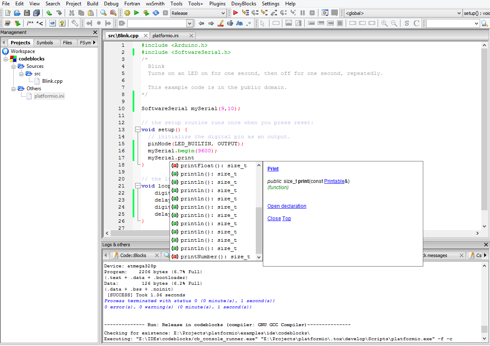

..  Copyright 2014-2016 Ivan Kravets <me@ikravets.com>
    Licensed under the Apache License, Version 2.0 (the "License");
    you may not use this file except in compliance with the License.
    You may obtain a copy of the License at
       http://www.apache.org/licenses/LICENSE-2.0
    Unless required by applicable law or agreed to in writing, software
    distributed under the License is distributed on an "AS IS" BASIS,
    WITHOUT WARRANTIES OR CONDITIONS OF ANY KIND, either express or implied.
    See the License for the specific language governing permissions and
    limitations under the License.

.. _ide_codeblocks:

CodeBlocks
==========

Code::Blocks is a free, open-source cross-platform IDE that supports multiple 
compilers including GCC, Clang and Visual C++. It is developed in C++ using 
wxWidgets as the GUI toolkit. Using a plugin architecture, its capabilities 
and features are defined by the provided plugins. Currently, Code::Blocks is 
oriented towards C, C++, and Fortran.

CodeBlocks IDE can be downloaded from `here <http://www.codeblocks.org/downloads>`_.

.. contents::

Integration
-----------

Choose board ``type`` using :ref:`cmd_boards` or `Embedded Boards Explorer <http://platformio.org/boards>`_
command and generate project via :option:`platformio init --ide` command:

.. code-block:: shell

    platformio init --ide codeblocks --board %TYPE%

    # For example, generate project for Arduino UNO
    platformio init --ide codeblocks --board uno

Then:

1. Open this project via ``Menu: File > Open...``
2. Add new files to ``src`` directory (``*.c, *.cpp, *.ino, etc.``) via
   ``Menu: File > New > File...``
3. Build project using ``Menu: Build > Build``
4. Upload firmware using ``Menu: Build > Run``

.. warning::
    The libraries which are added, installed or used in the project
    after generating process wont be reflected in IDE. To fix it you
    need to reinitialize project using :ref:`cmd_init` (repeat it).
