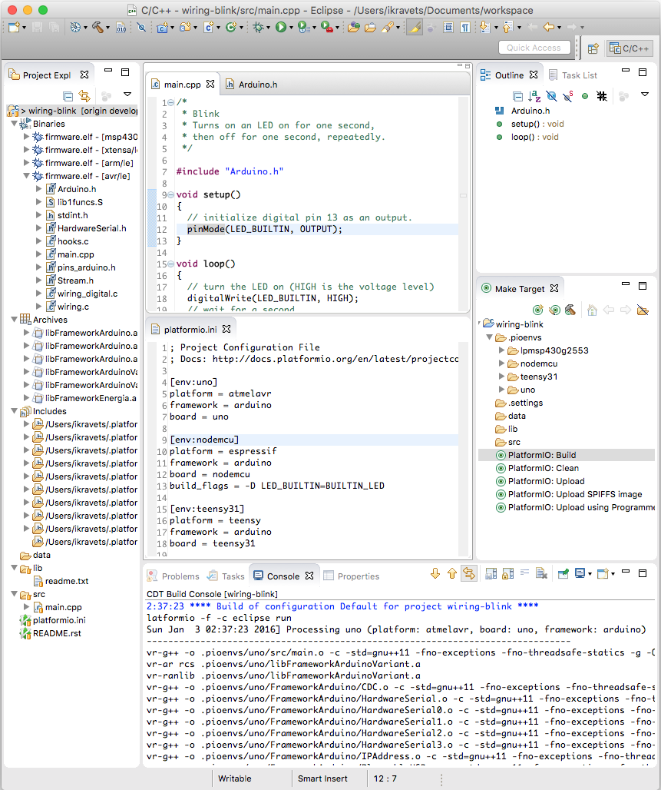

..  Copyright 2014-2016 Ivan Kravets <me@ikravets.com>
    Licensed under the Apache License, Version 2.0 (the "License");
    you may not use this file except in compliance with the License.
    You may obtain a copy of the License at
       http://www.apache.org/licenses/LICENSE-2.0
    Unless required by applicable law or agreed to in writing, software
    distributed under the License is distributed on an "AS IS" BASIS,
    WITHOUT WARRANTIES OR CONDITIONS OF ANY KIND, either express or implied.
    See the License for the specific language governing permissions and
    limitations under the License.

.. _ide_eclipse:

Eclipse
=======

The `Eclipse CDT (C/C++ Development Tooling) <https://eclipse.org/cdt/>`_
Project provides a fully functional C and C++ Integrated Development
Environment based on the Eclipse platform. Features include: support for
project creation and managed build for various toolchains, standard make
build, source navigation, various source knowledge tools, such as type
hierarchy, call graph, include browser, macro definition browser, code editor
with syntax highlighting, folding and hyperlink navigation, source code
refactoring and code generation, visual debugging tools, including memory,
registers, and disassembly viewers.

Refer to the `CDT Documentation <https://eclipse.org/cdt/documentation.php>`_
page for more detailed information.

.. contents::

Integration
-----------

Choose board ``type`` using :ref:`cmd_boards` or `Embedded Boards Explorer <http://platformio.org/#!/boards>`_
command and generate project via :option:`platformio init --ide` command:

.. code-block:: shell

    platformio init --ide eclipse --board %TYPE%

    # For example, generate project for Arduino UNO
    platformio init --ide eclipse --board uno

Then:

1. Import this project via
   ``Menu: File > Import... > General > Existing Projects into Workspace > Next``
   and specify root directory where is located :ref:`projectconf`
2. Open source file from ``src`` directory (``*.c, *.cpp, *.ino, etc.``)
3. Build project using ``Menu: Project > Build Project`` or preconfigured
   Make Targets (see screenshot below):

   + ``PlatformIO: Build`` - Build project without auto-uploading
   + ``PlatformIO: Clean`` - Clean compiled objects.
   + ``PlatformIO: Upload`` - Build and upload (if no errors)
   + ``PlatformIO: Upload using Programmer`` see :ref:`atmelavr_upload_via_programmer`
   + ``PlatformIO: Upload SPIFFS image`` see :ref:`platform_espressif_uploadfs`
   + ``PlatformIO: Update platforms and libraries`` - Update installed platforms and libraries via :ref:`cmd_update`.

If you have some problems with unresolved includes, defines, etc., then

* Restart Eclipse IDE
* Rebuild index using ``Menu: Project > C/C++ Index > Rebuild``.

.. warning::
    The libraries which are added, installed or used in the project
    after generating process wont be reflected in IDE. To fix it you
    need to reinitialize project using :ref:`cmd_init` (repeat it).

Articles / Manuals
------------------

* Sep 01, 2015 - **Thomas P. Weldon, Ph.D.** - `Improvised MBED FRDM-K64F Eclipse/PlatformIO Setup and Software Installation <http://thomasweldon.com/tpw/courses/embeddsp/p00pcFrdmK64_eclipsePlatformioSetup.html>`_
* Jul 11, 2015 - **TrojanC** - `Learning Arduino GitHub Repository <http://www.trojanc.co.za/2015/07/11/learning-arduino-github-repository/>`_
* June 20, 2014 - **Ivan Kravets, Ph.D.** - `Building and debugging Atmel AVR (Arduino-based) project using Eclipse IDE+PlatformIO <http://www.ikravets.com/computer-life/programming/2014/06/20/building-and-debugging-atmel-avr-arduino-based-project-using-eclipse-ideplatformio>`_

See a full list with :ref:`articles`.

Screenshot
----------

Cross-platform `Blink Project <http://platformio.org/#!/get-started#blink-project-example>`_.

Examples
--------

"Blink" Project
^^^^^^^^^^^^^^^

Source code of `Eclipse "Blink" Project <https://github.com/platformio/platformio/tree/develop/examples/ide/eclipse>`_.
