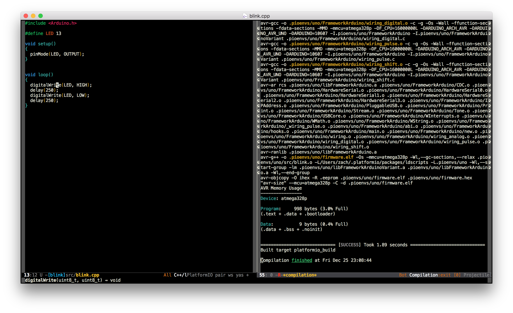

..  Copyright 2014-present PlatformIO <contact@platformio.org>
    Licensed under the Apache License, Version 2.0 (the "License");
    you may not use this file except in compliance with the License.
    You may obtain a copy of the License at
       http://www.apache.org/licenses/LICENSE-2.0
    Unless required by applicable law or agreed to in writing, software
    distributed under the License is distributed on an "AS IS" BASIS,
    WITHOUT WARRANTIES OR CONDITIONS OF ANY KIND, either express or implied.
    See the License for the specific language governing permissions and
    limitations under the License.

.. _ide_emacs:

Emacs
=====

GNU Emacs is an extensible, customizable text editor - and more. At its core is
an interpreter for Emacs Lisp, a dialect of the
`Lisp programming language <http://en.wikipedia.org/wiki/Lisp_programming_language>`_
with extensions to support text editing.

Refer to the `Emacs Documentation <https://www.gnu.org/software/emacs/#Manuals>`_
page for more detailed information.

.. contents::

Integration
-----------

PlatformIO-Mode
^^^^^^^^^^^^^^^

An Emacs minor mode has been written to facilitate building and uploading from within Emacs.
It can be installed from the MELPA repository using ``M-x package-install``.
See the MELPA `Getting Started <https://melpa.org/#/getting-started>`_ page for more information.

Setup instructions and an example config can be found at the `Github page <https://github.com/ZachMassia/platformio-mode>`_.

Code completion can optionally be provided by installing `irony-mode <https://github.com/Sarcasm/irony-mode>`_

Project Generator
^^^^^^^^^^^^^^^^^

Choose board ``ID`` using :ref:`cmd_boards` or `Embedded Boards Explorer <http://platformio.org/boards>`_
command and generate project via :option:`platformio init --ide` command:

.. code-block:: shell

    platformio init --ide emacs --board %ID%

There are 6 predefined targets for building.

* ``platformio_build``  - Build project without auto-uploading.        (``C-c i b``)
* ``platformio_clean``  - Clean compiled objects.                      (``C-c i c``)
* ``platformio_upload`` - Build and upload (if no errors).             (``C-c i u``)
* ``platformio_programmer_upload`` - Build and upload using external programmer (if no errors, see :ref:`atmelavr_upload_via_programmer`). (``C-c i p``)
* ``platformio_spiffs_upload``  - Upload files to file system SPIFFS (see :ref:`platform_espressif_uploadfs`). (``C-c i s``)
* ``platformio_update`` - Update installed platforms and libraries.    (``C-c i d``)

.. warning::
    The libraries which are added, installed or used in the project
    after generating process wont be reflected in IDE. To fix it you
    need to reinitialize project using :ref:`cmd_init` (repeat it).
