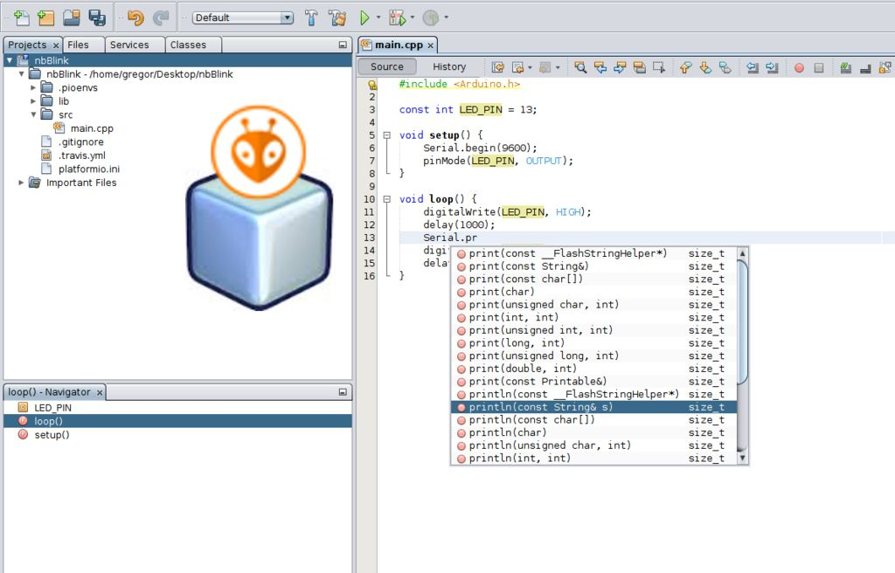

..  Copyright 2014-2016 Ivan Kravets <me@ikravets.com>
    Licensed under the Apache License, Version 2.0 (the "License");
    you may not use this file except in compliance with the License.
    You may obtain a copy of the License at
       http://www.apache.org/licenses/LICENSE-2.0
    Unless required by applicable law or agreed to in writing, software
    distributed under the License is distributed on an "AS IS" BASIS,
    WITHOUT WARRANTIES OR CONDITIONS OF ANY KIND, either express or implied.
    See the License for the specific language governing permissions and
    limitations under the License.

.. _ide_netbeans:

NetBeans
========

NetBeans is a Java-based integrated development environment (IDE). It provides
out-of-the-box code analyzers and editors for working with the latest Java 8
technologies--Java SE 8, Java SE Embedded 8, and Java ME Embedded 8. The IDE
also has a range of new tools for HTML5/JavaScript, in particular for Node.js,
KnockoutJS, and AngularJS; enhancements that further improve its support for
Maven and Java EE with PrimeFaces; and improvements to PHP and C/C++ support.

Refer to the `C/C++ Application Learning Trail <https://netbeans.org/kb/trails/cnd.html>`_
for details.

.. contents::

Integration
-----------

Please follow to `How to Integrate PlatformIO with Netbeans <http://www.instructables.com/id/How-to-Integrate-PlatformIO-With-Netbeans/>`_ instructions.

Articles / Manuals
------------------

* Feb 22, 2016 - **Grzegorz Hołdys** - `How to Integrate PlatformIO with Netbeans <http://www.instructables.com/id/How-to-Integrate-PlatformIO-With-Netbeans/>`_

See the full list with :ref:`articles`.

Screenshot
-----------

