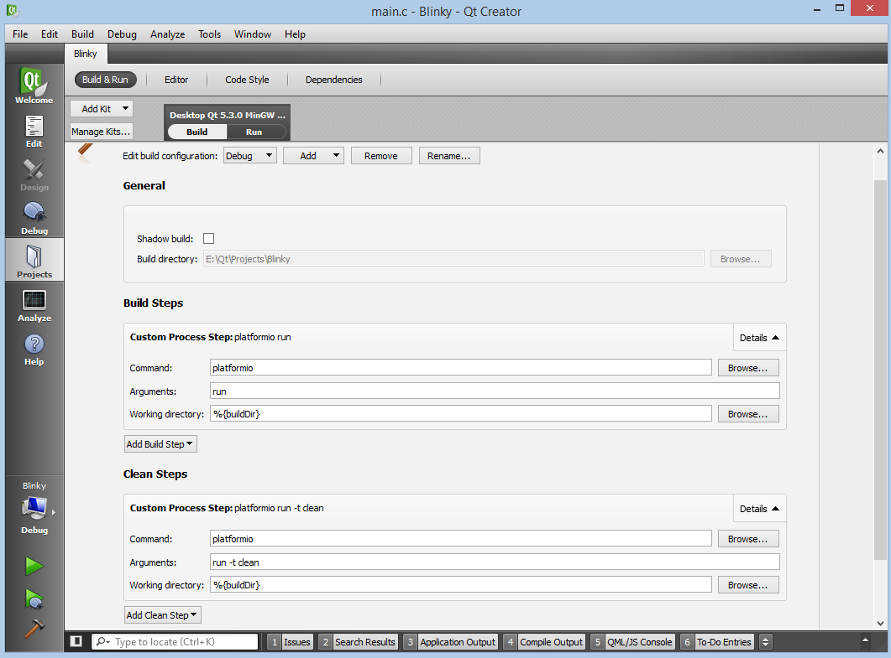
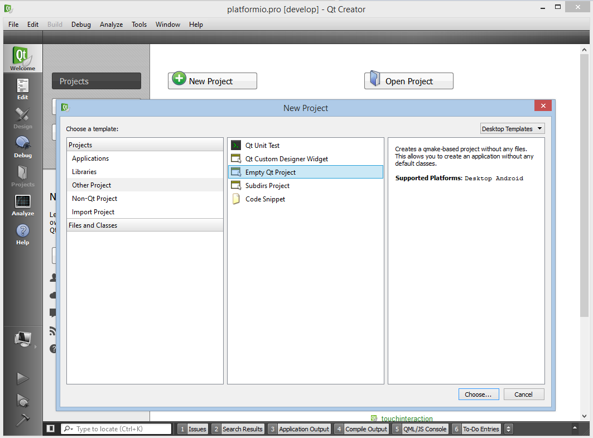
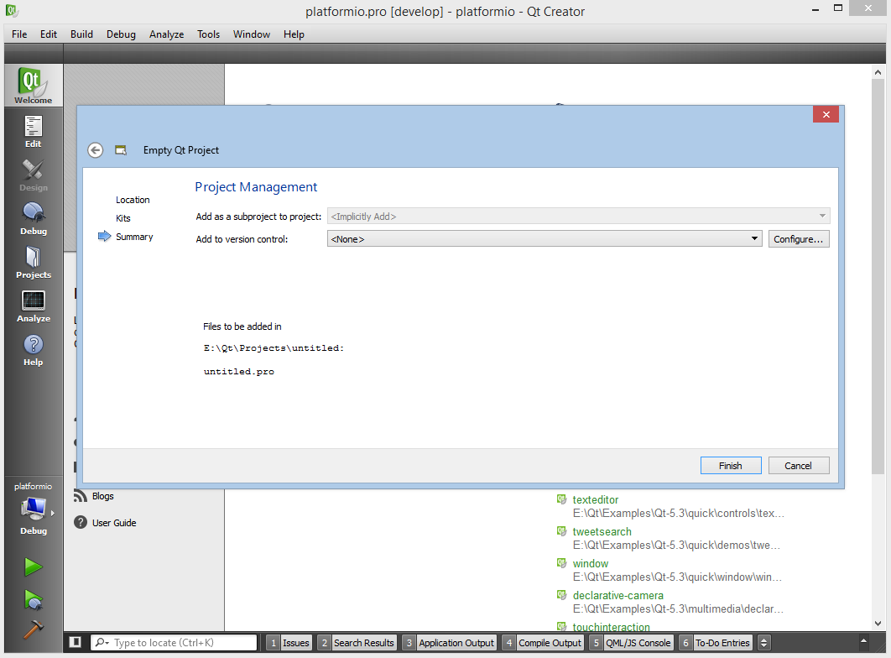
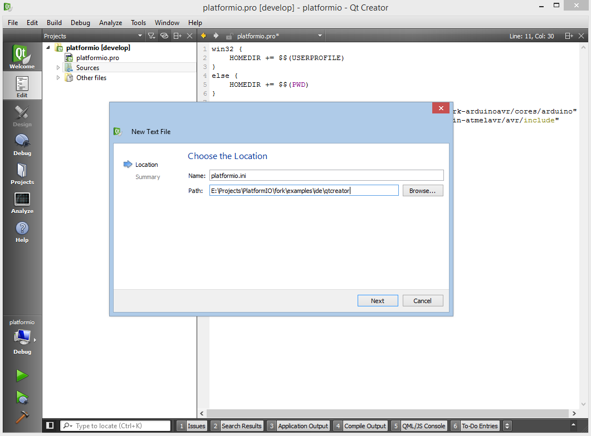
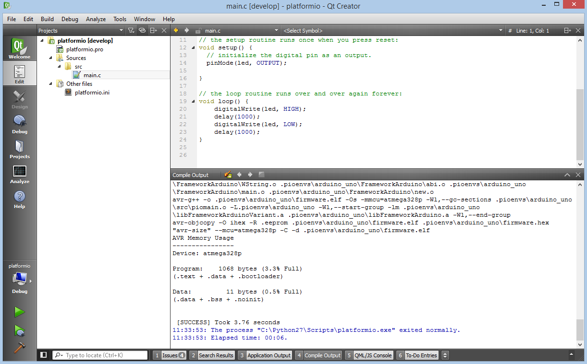

.. _ide_qtcreator:

Qt Creator
==========

The `Qt Creator <https://github.com/qtproject/qt-creator>`_ is an open source cross-platform integrated development environment. The editor includes such features as syntax highlighting for various languages, project manager, integrated version control systems, rapid code navigation tools and code autocompletion.

This software can be used with:

* all available :ref:`platforms`
* all available :ref:`frameworks`

Refer to the `Qt-creator Manual <http://doc.qt.io/qtcreator/>`_
page for more detailed information.

.. contents::

Integration
-----------

.. note::
    Please verify that folder where is located ``platformio`` program is added
    to `PATH (wiki) <https://en.wikipedia.org/wiki/PATH_(variable)>`_ environment
    variable. See FAQ: :ref:`faq_troubleshooting_pionotfoundinpath`.

Project Generator
^^^^^^^^^^^^^^^^^

Since PlatformIO 2.0 you can generate Qt Creator compatible project using
:option:`platformio init --ide` command. Please choose board type using
:ref:`cmd_boards` command and run:

.. code-block:: shell

    platformio init --ide qtcreator --board %TYPE%

Then import this project via ``File > New File or Project > Import Project``
and specify root directory where is located :ref:`projectconf`.

After import need to delete default "build" & "clean" steps and configure
project with PlatformIO source code builder (click on Projects label on left
menu or ``Ctrl+5`` shortcut):

Manual Integration
^^^^^^^^^^^^^^^^^^

Setup New Project
~~~~~~~~~~~~~~~~~

First of all, let's create new project from Qt Creator Start Page: ``New Project`` or using ``Menu: File > New File or Project``, then select project with ``Empty Qt Project`` type (``Other Project > Empty Qt Project``), fill ``Name``, ``Create in``.

On the next steps select any available kit and click Finish button.

Secondly, we need to delete default build and clean steps and configure project with PlatformIO source code builder (click on Projects label on left menu or ``Ctrl+5`` shortcut):

Thirdly, change project file by adding path to directories with header files. Please edit project file to match the following contents:

.. code-block:: none

    win32 {
        HOMEDIR += $$(USERPROFILE)
    }
    else {
        HOMEDIR += $$(HOME)
    }

    INCLUDEPATH += "$${HOMEDIR}/.platformio/packages/framework-arduinoavr/cores/arduino"
    INCLUDEPATH += "$${HOMEDIR}/.platformio/packages/toolchain-atmelavr/avr/include"

.. image:: ../_static/ide-platformio-qtcreator-4.png
    :target: http://docs.platformio.org/en/latest/_static/ide-platformio-qtcreator-4.png

First program in Qt Creator
~~~~~~~~~~~~~~~~~~~~~~~~~~~

Simple "Blink" project will consist from two files:
1. In the console, navigate to the root of your project folder and initialize platformio project with ``platformio init``
2. The main "C" source file named ``main.c`` must be located in the ``src`` directory.
Let's create new text file named ``main.c`` using ``Menu: New File or Project > General > Text File``:

Copy the source code which is described below to file ``main.c``.

.. code-block:: c

    #include "Arduino.h"
    #define WLED    13  // Most Arduino boards already have an LED attached to pin 13 on the board itself

    void setup()
    {
      pinMode(WLED, OUTPUT);  // set pin as output
    }

    void loop()
    {
      digitalWrite(WLED, HIGH);  // set the LED on
      delay(1000);               // wait for a second
      digitalWrite(WLED, LOW);   // set the LED off
      delay(1000);               // wait for a second
    }

3. Locate the project configuration file named ``platformio.ini`` at the root of the project directory and open it.

Edit the content to match the code described below.

.. code-block:: none

    #
    # Project Configuration File
    #
    # A detailed documentation with the EXAMPLES is located here:
    # http://docs.platformio.org/en/latest/projectconf.html
    #

    # A sign `#` at the beginning of the line indicates a comment
    # Comment lines are ignored.

    [env:arduino_uno]
    platform = atmelavr
    framework = arduino
    board = uno

Conclusion
~~~~~~~~~~

Taking everything into account, we can build project with shortcut ``Ctrl+Shift+B`` or using ``Menu: Build > Build All``.

Screenshot
----------

Examples
--------

"Blink" Project
^^^^^^^^^^^^^^^

Source code of `Qt Creator "Blink" Project <https://github.com/platformio/platformio/tree/develop/examples/ide/qtcreator>`_.
