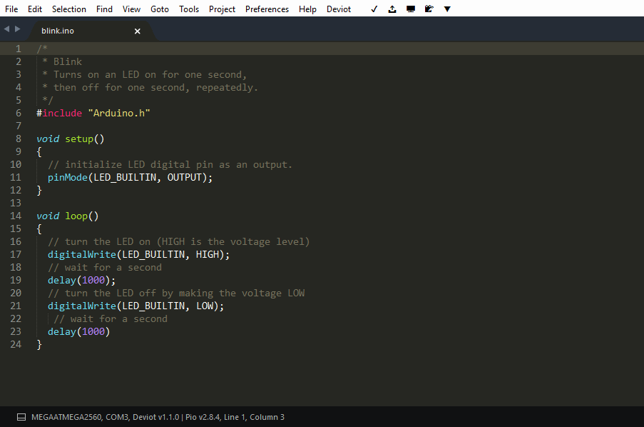
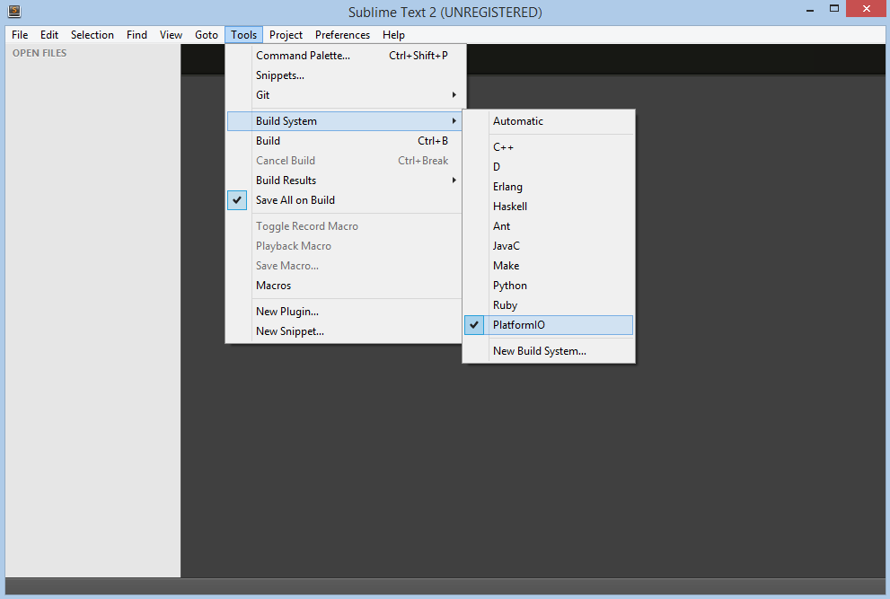
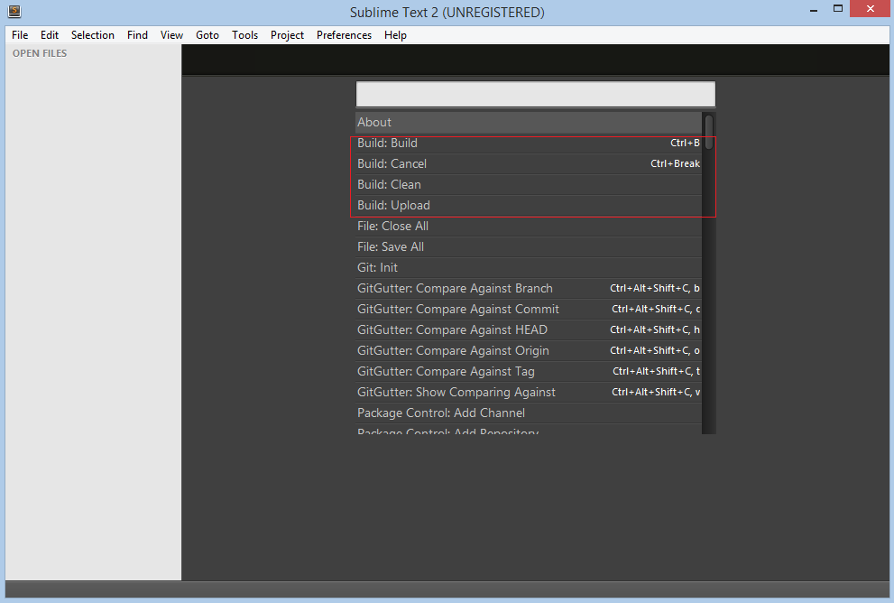
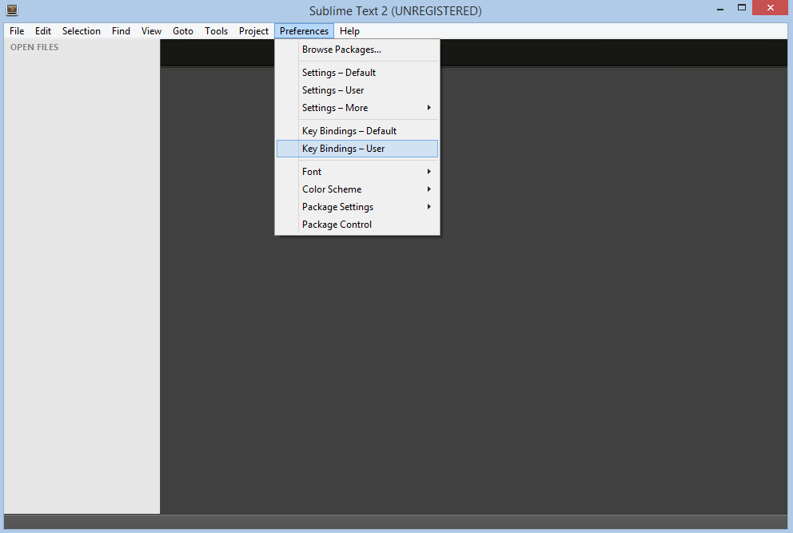

..  Copyright 2014-present PlatformIO <contact@platformio.org>
    Licensed under the Apache License, Version 2.0 (the "License");
    you may not use this file except in compliance with the License.
    You may obtain a copy of the License at
       http://www.apache.org/licenses/LICENSE-2.0
    Unless required by applicable law or agreed to in writing, software
    distributed under the License is distributed on an "AS IS" BASIS,
    WITHOUT WARRANTIES OR CONDITIONS OF ANY KIND, either express or implied.
    See the License for the specific language governing permissions and
    limitations under the License.

.. _ide_sublimetext:

Sublime Text
============

The `Sublime Text <http://www.sublimetext.com/>`_ is a cross-platform text and source code editor, with a Python application programming interface (API). Sublime Text is proprietary software. Its functionality is extendable with plugins. Most of the extending packages have free-software licenses and are community-built and maintained. Sublime Text lacks graphical setting dialogues and is entirely configured by editing text files.

Refer to the `Sublime Text Documentation <http://docs.sublimetext.info/en/latest>`_
page for more detailed information.

.. contents::

Integration
-----------

Deviot Plugin
^^^^^^^^^^^^^

We are glad to inform you about awesome Sublime Text plugin for IoT development
named `Deviot <https://github.com/gepd/Deviot>`_. It is based on
:ref:`core` and will automatically install it for you. Please visit `official
Deviot page <https://github.com/gepd/Deviot>`_ for the further installation
steps and documentation.

Project Generator
^^^^^^^^^^^^^^^^^

Choose board ``ID`` using :ref:`cmd_boards` or `Embedded Boards Explorer <http://platformio.org/boards>`_
command and generate project via :option:`platformio init --ide` command:

.. code-block:: shell

    platformio init --ide sublimetext --board <ID>

    # For example, generate project for Arduino UNO
    platformio init --ide sublimetext --board uno

Then:

1. Import project via ``Menu: Project > Open Project...`` and select
   ``platformio.sublime-project`` from the folder where is located :ref:`projectconf`
2. Select PlatformIO as build system: ``Menu: Tools > Build System > PlatformIO``
3. Open source file from ``src`` directory (``*.c, *.cpp, *.ino, etc.``)
4. Build project: ``Menu: Tools > Build``.

Also, you can access to all pre-configured targets via
``Menu: Tools > Builds With...`` (ST3)

+ ``PlatformIO - Build`` - Build project without auto-uploading
+ ``PlatformIO - Clean`` - Clean compiled objects.
+ ``PlatformIO - Upload`` - Build and upload (if no errors)
+ ``PlatformIO - Upload using Programmer`` see :ref:`atmelavr_upload_via_programmer`
+ ``PlatformIO - Upload SPIFFS image`` see :ref:`platform_espressif_uploadfs`
+ ``PlatformIO - Update platforms and libraries`` - Update installed platforms and libraries via :ref:`cmd_update`.

Manual Integration
^^^^^^^^^^^^^^^^^^

.. note::
    Please verify that folder where is located ``platformio`` program is added
    to `PATH (wiki) <https://en.wikipedia.org/wiki/PATH_(variable)>`_ environment
    variable. See FAQ: :ref:`faq_troubleshooting_pionotfoundinpath`.

Initial configuration
~~~~~~~~~~~~~~~~~~~~~

First of all, we need to create "New Build System" with name "PlatformIO"
from ``Menu: Tools > Build System > New Build System`` and fill it like
described below:

.. code-block:: bash

    {
        "cmd": ["platformio", "-f", "-c", "sublimetext", "run"],
        "working_dir": "${project_path:${folder}}",
        "variants":
        [
            {
                "name": "Clean",
                "cmd": ["platformio", "-f", "-c", "sublimetext", "run", "--target", "clean"]
            },
            {
                "name": "Upload",
                "cmd": ["platformio", "-f", "-c", "sublimetext", "run", "--target", "upload"]
            }
        ]
    }

Secondly, we need to select "PlatformIO" Build System from a list:

After that, we can use the necessary commands from
``Menu: Tools > Command Palette`` or with ``Ctrl+Shift+P`` (Windows/Linux)
``Cmd+Shift+P`` (Mac) shortcut.

Command Hotkeys
'''''''''''''''

Sublime Text allows to bind own hotkey per command. Let's setup them
for PlatformIO commands using shortcut ``Menu: Preferences > Key-Bindings - User``:

We are going to use these shortcuts:

* ``F11`` for clean project
* ``F12`` for upload firmware to target device

In this case, the final code will look like:

.. code-block:: none

    [
        { "keys": ["f11"], "command": "build", "args": {"variant": "Clean"} },
        { "keys": ["f12"], "command": "build", "args": {"variant": "Upload"} }
    ]

First program in Sublime Text
~~~~~~~~~~~~~~~~~~~~~~~~~~~~~

Simple "Blink" project will consist from two files:

1. Main "C" source file named ``main.c`` must be located in the ``src`` directory.
Let's create new file named ``main.c`` using ``Menu: File > New File`` or shortcut ``Ctrl+N`` (Windows/Linux) ``Cmd+N`` (Mac) with the next contents:

.. code-block:: c

    #include "Arduino.h"
    #define WLED    13  // Most Arduino boards already have an LED attached to pin 13 on the board itself

    void setup()
    {
      pinMode(WLED, OUTPUT);  // set pin as output
    }

    void loop()
    {
      digitalWrite(WLED, HIGH);  // set the LED on
      delay(1000);               // wait for a second
      digitalWrite(WLED, LOW);   // set the LED off
      delay(1000);               // wait for a second
    }

2. Project Configuration File named ``platformio.ini`` must be located in the project root directory.
Copy the source code which is described below to it.

.. code-block:: ini

    ; PlatformIO Project Configuration File
    ;
    ;   Build options: build flags, source filter, extra scripting
    ;   Upload options: custom port, speed and extra flags
    ;   Library options: dependencies, extra library storages
    ;
    ; Please visit documentation for the other options and examples
    ; http://docs.platformio.org/en/stable/projectconf.html

    [env:arduino_uno]
    platform = atmelavr
    framework = arduino
    board = uno

Conclusion
~~~~~~~~~~

Taking everything into account, we can open project directory in Sublime Text using ``Menu: File > Open Folder`` and build it with shortcut ``Ctrl+B`` (Windows/Linux) or ``Cmd+B`` (Mac), clean project with shortcut ``F11`` and upload firmware to target with shortcut ``F12``.

Examples
--------

"Blink" Project
^^^^^^^^^^^^^^^

Source code of `Sublime Text "Blink" Project <https://github.com/platformio/platformio-examples/tree/develop/ide/sublimetext>`_.
