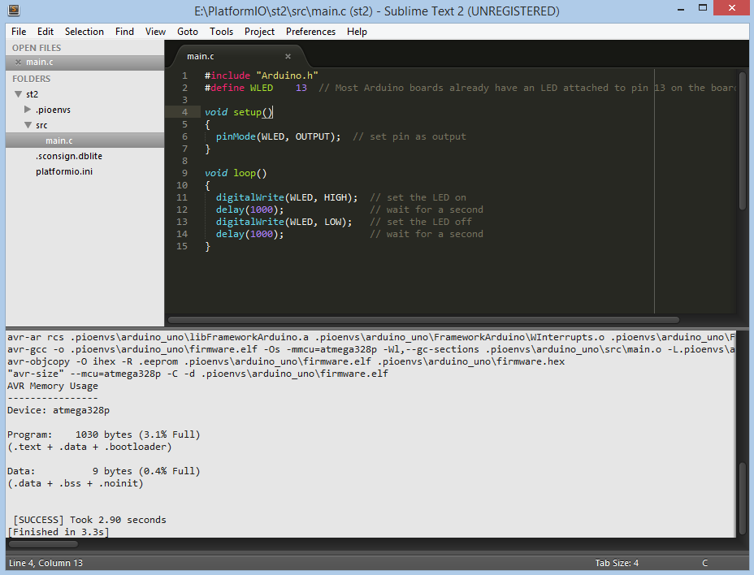

.. _ide_sublimetext:

Sublime Text
============

The `Sublime Text <http://www.sublimetext.com/>`_ is a cross-platform text and source code editor, with a Python application programming interface (API). Sublime Text is proprietary software. Its functionality is extendable with plugins. Most of the extending packages have free-software licenses and are community-built and maintained. Sublime Text lacks graphical setting dialogues and is entirely configured by editing text files.

This software can be used with:

* all available :ref:`platforms`
* all available :ref:`frameworks`

Refer to the `Sublime Text Documentation <http://docs.sublimetext.info/en/latest>`_
page for more detailed information.

.. contents::

Integration
-----------

Project Generator
^^^^^^^^^^^^^^^^^

Since PlatformIO 2.0 you can generate Eclipse compatible project using
:option:`platformio init --ide` command:

.. code-block:: shell

    platformio init --ide sublimetext

Then import this project via ``Project > Open Project...`` and specify root
directory where is located :ref:`projectconf`.

Manual Integration
^^^^^^^^^^^^^^^^^^

Initial configuration
~~~~~~~~~~~~~~~~~~~~~

First of all, we need to create "New Build System" with name "PlatformIO"
from ``Menu: Tools > Build System > New Build System`` and fill it like
described below:

.. code-block:: bash

    {
        "cmd": ["platformio", "run"],
        "working_dir": "${project_path:${folder}}",
        "variants":
        [
            {
                "name": "Clean",
                "cmd": ["platformio", "run", "-t", "clean"]
            },
            {
                "name": "Upload",
                "cmd": ["platformio", "run", "-t", "upload"]
            }
        ]
    }

Secondly, we need to select "PlatformIO" Build System from a list:

.. image:: ../_static/ide-sublime-text-platformio-newproject-2.png

After that, we can use the necessary commands from
``Menu: Tools > Command Palette`` or with ``Ctrl+Shift+P`` (Windows/Linux)
``Cmd+Shift+P`` (Mac) shortcut.

.. image:: ../_static/ide-sublime-text-platformio-newproject-3.png

Command Hotkeys
'''''''''''''''

Sublime Text allows to bind own hotkey per command. Let's setup them
for PlatformIO commands using shortcut ``Menu: Preferences > Key-Bindings - User``:

.. image:: ../_static/ide-sublime-text-platformio-newproject-4.png

We are going to use these shortcuts:

* ``F11`` for clean project
* ``F12`` for upload firmware to target device

In this case, the final code will look like:

.. code-block:: none

    [
        { "keys": ["f11"], "command": "build", "args": {"variant": "Clean"} },
        { "keys": ["f12"], "command": "build", "args": {"variant": "Upload"} }
    ]

First program in Sublime Text
~~~~~~~~~~~~~~~~~~~~~~~~~~~~~

Simple "Blink" project will consist from two files:

1. Main "C" source file named ``main.c`` must be located in the ``src`` directory.
Let's create new file named ``main.c`` using ``Menu: File > New File`` or shortcut ``Ctrl+N`` (Windows/Linux) ``Cmd+N`` (Mac) with the next contents:

.. code-block:: c

    #include "Arduino.h"
    #define WLED    13  // Most Arduino boards already have an LED attached to pin 13 on the board itself

    void setup()
    {
      pinMode(WLED, OUTPUT);  // set pin as output
    }

    void loop()
    {
      digitalWrite(WLED, HIGH);  // set the LED on
      delay(1000);               // wait for a second
      digitalWrite(WLED, LOW);   // set the LED off
      delay(1000);               // wait for a second
    }

2. Project Configuration File named ``platformio.ini`` must be located in the project root directory.
Copy the source code which is described below to it.

.. code-block:: none

    #
    # Project Configuration File
    #
    # A detailed documentation with the EXAMPLES is located here:
    # http://docs.platformio.org/en/latest/projectconf.html
    #

    # A sign `#` at the beginning of the line indicates a comment
    # Comment lines are ignored.

    [env:arduino_uno]
    platform = atmelavr
    framework = arduino
    board = uno

Conclusion
----------

Taking everything into account, we can open project directory in Sublime Text using ``Menu: File > Open Folder`` and build it with shortcut ``Ctrl+B`` (Windows/Linux) or ``Cmd+B`` (Mac), clean project with shortcut ``F11`` and upload firmware to target with shortcut ``F12``.

