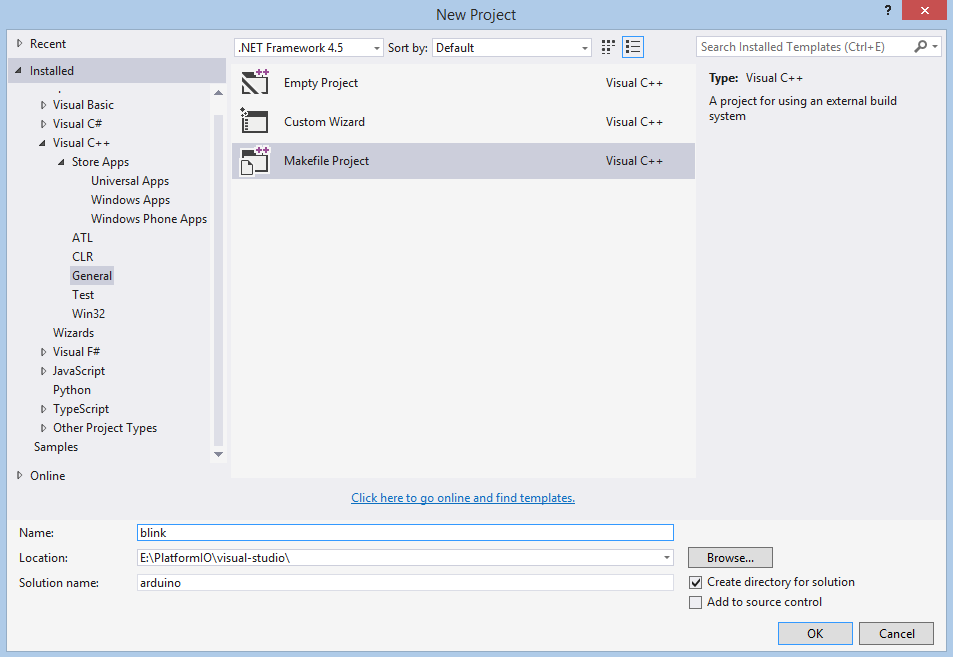
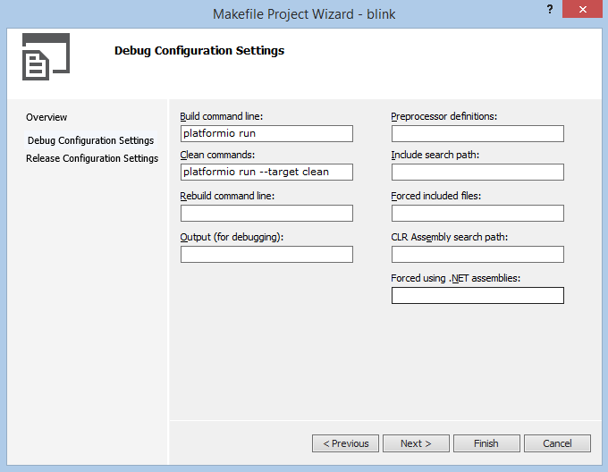
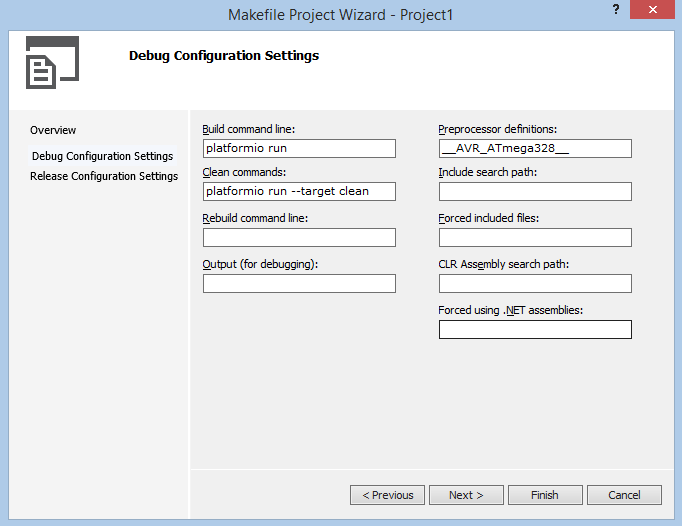
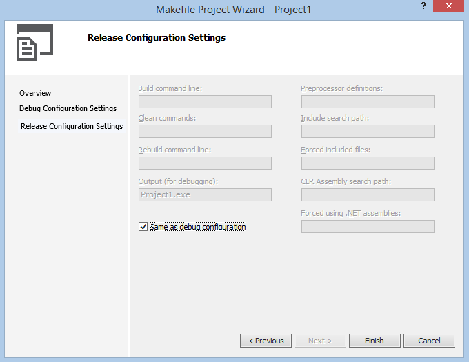
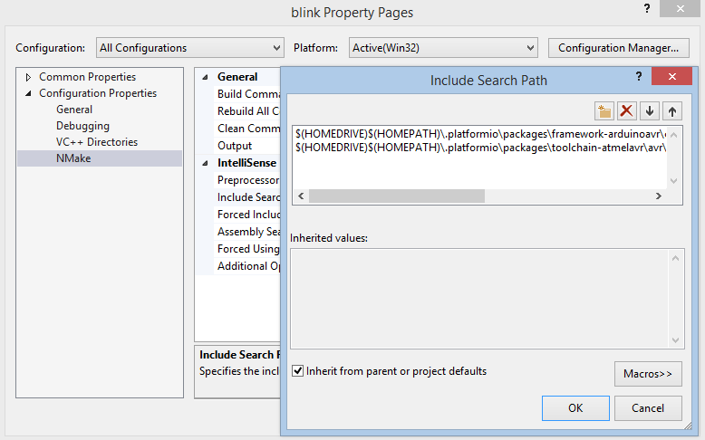
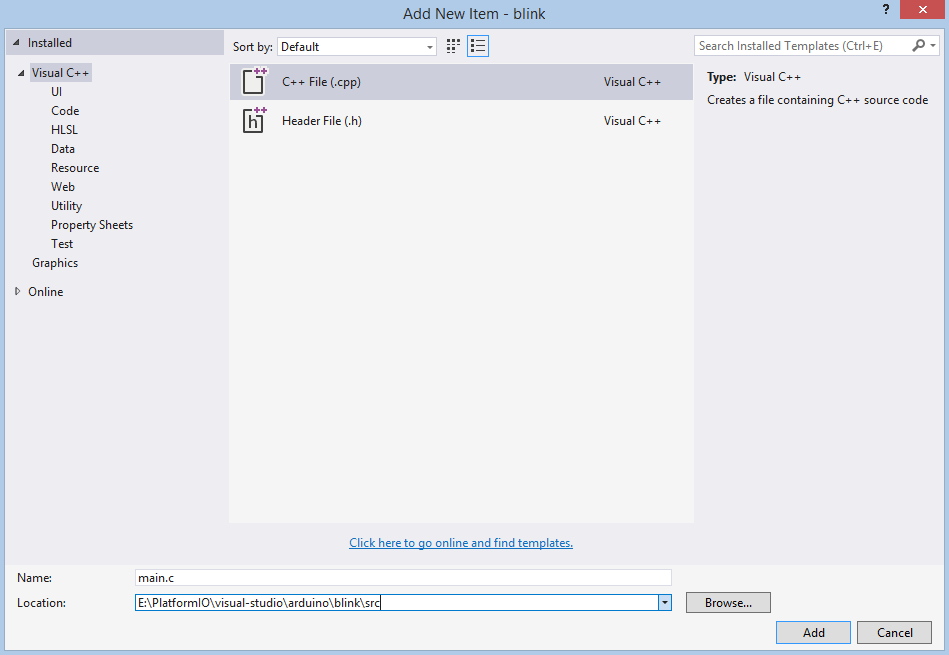
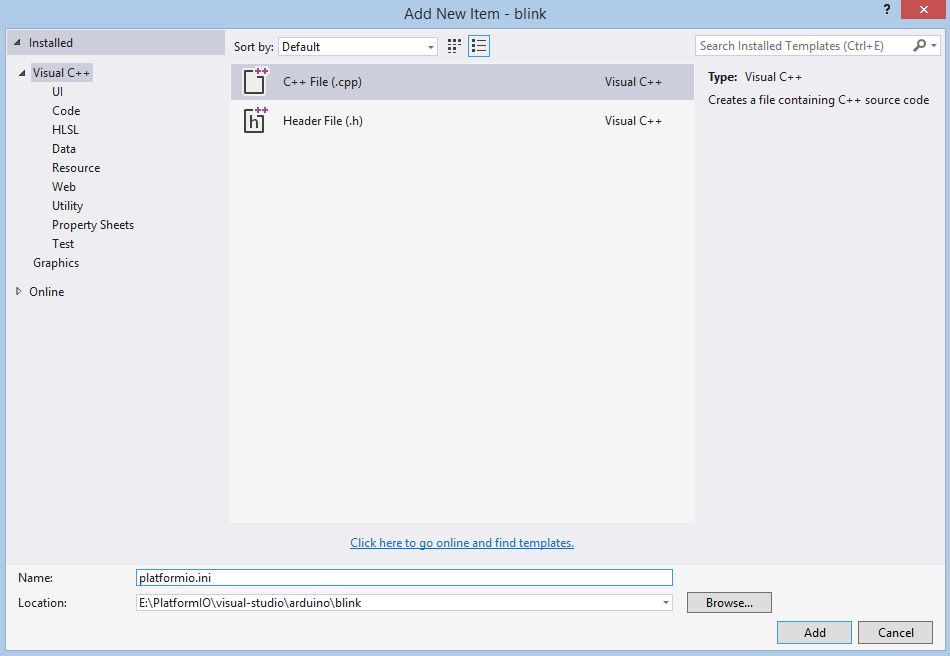
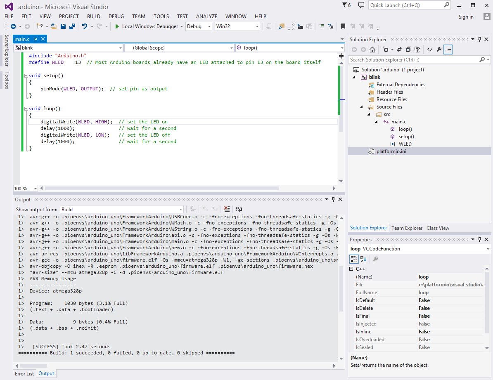

..  Copyright 2014-2015 Ivan Kravets <me@ikravets.com>
    Licensed under the Apache License, Version 2.0 (the "License");
    you may not use this file except in compliance with the License.
    You may obtain a copy of the License at
       http://www.apache.org/licenses/LICENSE-2.0
    Unless required by applicable law or agreed to in writing, software
    distributed under the License is distributed on an "AS IS" BASIS,
    WITHOUT WARRANTIES OR CONDITIONS OF ANY KIND, either express or implied.
    See the License for the specific language governing permissions and
    limitations under the License.

.. _ide_visualstudio:

Visual Studio
=============

The `Microsoft Visual Studio (Free) <http://visualstudio.com/free>`_ is an integrated development environment (IDE) from Microsoft. Visual Studio includes a code editor supporting IntelliSense (the code completion component) as well as code refactoring.

This software can be used with:

* all available :ref:`platforms`
* all available :ref:`frameworks`

Refer to the `Visual Studio Documentation <https://msdn.microsoft.com/library/vstudio>`_
page for more detailed information.

.. contents::

Integration
-----------

.. note::
    Please verify that folder where is located ``platformio`` program is added
    to `PATH (wiki) <https://en.wikipedia.org/wiki/PATH_(variable)>`_ environment
    variable. See FAQ: :ref:`faq_troubleshooting_pionotfoundinpath`.

Project Generator
^^^^^^^^^^^^^^^^^

Since PlatformIO 2.0 you can generate Visual Studio compatible project using
:option:`platformio init --ide` command. Please choose board type using
:ref:`cmd_boards` command and run:

.. code-block:: shell

    platformio init --ide visualstudio --board %TYPE%

Then:

1. Import this project via ``Menu: File > Open > Project/Solution``
   and specify root directory where is located :ref:`projectconf`
2. Open source file from ``src`` directory (``*.c, *.cpp, *.ino, etc.``)
3. Build project: ``Menu: Build > Build Solution``.

.. warning::
    The libraries which are added, installed or used in the project
    after generating process wont be reflected in IDE. To fix it you
    need to reinitialize project using :ref:`cmd_init` (repeat it).

Manual Integration
^^^^^^^^^^^^^^^^^^

Setup New Project
~~~~~~~~~~~~~~~~~

First of all, let's create new project from Visual Studio Start Page: ``Start > New Project`` or using ``Menu: File > New > Project``, then select project with ``Makefile`` type (``Visual C++ > General > Makefile Project``), fill ``Project name``, ``Solution name``, ``Location`` fields and press OK button.

Secondly, we need to configure project with PlatformIO source code builder:

If we want to use native AVR programming, we have to specify additional preprocessor symbol ("Preprocessor definitions" field) about your MCU. For example, an Arduino Uno is based on the ATmega328 MCU. In this case We will add new definition  ``__AVR_ATmega328__``.

Release Configuration is the same as Debug, so on the next step we check "Same as Debug Configuration" and click "Finish" button.

Thirdly, we need to add directories with header files using project properties (right click on the project name or ``Alt-Enter`` shortcut) and add two directories to ``Configuration Properties > NMake > Include Search Path``:

.. code-block:: none

    $(HOMEDRIVE)$(HOMEPATH)\.platformio\packages\toolchain-atmelavr\avr\include
    $(HOMEDRIVE)$(HOMEPATH)\.platformio\packages\framework-arduinoavr\cores\arduino

First program in Visual Studio
~~~~~~~~~~~~~~~~~~~~~~~~~~~~~~

Simple "Blink" project will consist from two files:

1. Main "C" source file named ``main.c`` must be located in the ``src`` directory.
Let's create new file named ``main.c`` using ``Menu: File > New File`` or shortcut ``Ctrl+N``:

Copy the source code which is described below to file ``main.c``.

.. code-block:: c

    #include "Arduino.h"
    #define WLED    13  // Most Arduino boards already have an LED attached to pin 13 on the board itself

    void setup()
    {
      pinMode(WLED, OUTPUT);  // set pin as output
    }

    void loop()
    {
      digitalWrite(WLED, HIGH);  // set the LED on
      delay(1000);               // wait for a second
      digitalWrite(WLED, LOW);   // set the LED off
      delay(1000);               // wait for a second
    }

2. Project Configuration File named ``platformio.ini`` must be located in the project root directory.

Copy the source code which is described below to it.

.. code-block:: none

    #
    # Project Configuration File
    #
    # A detailed documentation with the EXAMPLES is located here:
    # http://docs.platformio.org/en/latest/projectconf.html
    #

    # A sign `#` at the beginning of the line indicates a comment
    # Comment lines are ignored.

    [env:arduino_uno]
    platform = atmelavr
    framework = arduino
    board = uno

Conclusion
~~~~~~~~~~

Taking everything into account, we can build project with shortcut ``Ctrl+Shift+B`` or using ``Menu: Build > Build Solution``.

Screenshot
----------

Examples
--------

"Blink" Project
^^^^^^^^^^^^^^^

Source code of `Visual Studio "Blink" Project <https://github.com/platformio/platformio/tree/develop/examples/ide/visualstudio>`_.
