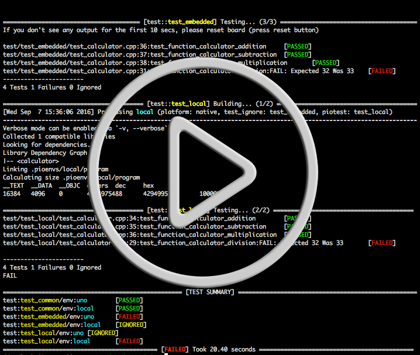

..  Copyright 2014-present PlatformIO <contact@platformio.org>
    Licensed under the Apache License, Version 2.0 (the "License");
    you may not use this file except in compliance with the License.
    You may obtain a copy of the License at
       http://www.apache.org/licenses/LICENSE-2.0
    Unless required by applicable law or agreed to in writing, software
    distributed under the License is distributed on an "AS IS" BASIS,
    WITHOUT WARRANTIES OR CONDITIONS OF ANY KIND, either express or implied.
    See the License for the specific language governing permissions and
    limitations under the License.

.. _unit_testing:

Unit Testing
============

.. versionadded:: 3.0 (`PlatformIO Plus <https://pioplus.com>`_)

`Unit Testing (wiki) <https://en.wikipedia.org/wiki/Unit_testing>`_
is a software testing method by which individual units of source code, sets
of one or more MCU program modules together with associated control data,
usage procedures, and operating procedures, are tested to determine whether
they are fit for use. Unit testing finds problems early in the development cycle.

PlatformIO Testing Engine supports 2 different test types:

1. **Local Test** - *[host, native]*, process test on the host machine
   using :ref:`platform_native`.
2. **Embedded Test** - *[remote, hardware]*, prepare special firmware for the
   target device and upload it. Run test on the embedded device and collect
   results. Process test results on the host machine.

   You will be able to run the same test on the different target devices
   (:ref:`embedded_boards`).

PlatformIO Testing Engine consists of:

* Project builder
* Test builder
* Firmware uploader (is used only for embedded test)
* Test processor

There is special command :ref:`cmd_test` to run tests from PlatformIO Project.
It allows to process specific environments or to ignore some tests using
"Glob patterns".

Also, is possible to ignore some tests for specific environment using
:ref:`projectconf_test_ignore` option from :ref:`projectconf`.

.. contents::

Demo
----

Demo of `Local & Embedded: Calculator <https://github.com/platformio/platformio-examples/tree/develop/unit-testing/calculator>`_.

.. _unit_testing_design:

Design
------

PlatformIO Testing Engine design is based on a few isolated components:

1. **Main program**. Contains the independent modules, procedures,
   functions or methods that will be the target candidates (TC) for testing.
2. **Unit test**. This a small independent program that is intended to
   re-use TC from the main program and apply tests for them.
3. **Test processor**. The set of approaches and tools that will be used
   to apply test for the environments from :ref:`projectconf`.

Workflow
--------

1. Create PlatformIO project using :ref:`cmd_init` command. For Local Unit
   Testing (on the host machine), need to use :ref:`platform_native`.

   .. code-block:: ini

        ; PlatformIO Project Configuration File
        ;
        ;   Build options: build flags, source filter, extra scripting
        ;   Upload options: custom port, speed and extra flags
        ;   Library options: dependencies, extra library storages
        ;
        ; Please visit documentation for the other options and examples
        ; http://docs.platformio.org/en/stable/projectconf.html

        ;
        ; Embedded platforms
        ;

        [env:uno]
        platform = atmelavr
        framework = arduino
        board = uno

        [env:nodemcu]
        platform = espressif8266
        framework = arduino
        board = nodemcuv2

        ;
        ; Local (PC, native) platforms
        ;

        [env:local]
        platform = native

2. Place source code of main program to ``src`` directory.
3. Wrap ``main()`` or ``setup()/loop()`` methods of main program in ``UNIT_TEST``
   guard:

   .. code-block:: c

        /**
        * Arduino Wiring-based Framework
        */
        #ifndef UNIT_TEST
        #include <Arduino.h>
        void setup () {
          // some code...
        }

        void loop () {
          // some code...
        }
        #endif

   .. code-block:: c

        /**
        * Generic C/C++
        */
        #ifndef UNIT_TEST
        int main(int argc, char **argv) {
          // setup code...

          while (1) {
              // loop code...
          }
          return 0
        }
        #endif

4. Create ``test`` directory in the root of project. See :ref:`projectconf_pio_test_dir`.
5. Write test using :ref:`unit_testing_api`. The each test is a small
   independent program with own ``main()`` or ``setup()/loop()`` methods. Also,
   test should start from ``UNITY_BEGIN()`` and finish with ``UNITY_END()``.
6. Place test to ``test`` directory. If you have more than one test, split them
   into sub-folders. For example, ``test/test_1/*.[c,cpp,h]``,
   ``test_N/*.[c,cpp,h]``, etc. If no such directory in ``test`` folder, then
   PlatformIO Testing Engine will treat the source code of ``test`` folder
   as SINGLE test.
7. Run tests using :ref:`cmd_test` command.

.. _unit_testing_api:

Test API
--------

The summary of `Unity Test API <https://github.com/ThrowTheSwitch/Unity#unity-test-api>`_:

* `Running Tests <https://github.com/ThrowTheSwitch/Unity#running-tests>`_

  - ``RUN_TEST(func, linenum)``

* `Ignoring Tests <https://github.com/ThrowTheSwitch/Unity#ignoring-tests>`_

  - ``TEST_IGNORE()``
  - ``TEST_IGNORE_MESSAGE (message)``

* `Aborting Tests <https://github.com/ThrowTheSwitch/Unity#aborting-tests>`_

  - ``TEST_PROTECT()``
  - ``TEST_ABORT()``

* `Basic Validity Tests <https://github.com/ThrowTheSwitch/Unity#basic-validity-tests>`_

  - ``TEST_ASSERT_TRUE(condition)``
  - ``TEST_ASSERT_FALSE(condition)``
  - ``TEST_ASSERT(condition)``
  - ``TEST_ASSERT_UNLESS(condition)``
  - ``TEST_FAIL()``
  - ``TEST_FAIL_MESSAGE(message)``

* `Numerical Assertions: Integers <https://github.com/ThrowTheSwitch/Unity#numerical-assertions-integers>`_

  - ``TEST_ASSERT_EQUAL_INT(expected, actual)``
  - ``TEST_ASSERT_EQUAL_INT8(expected, actual)``
  - ``TEST_ASSERT_EQUAL_INT16(expected, actual)``
  - ``TEST_ASSERT_EQUAL_INT32(expected, actual)``
  - ``TEST_ASSERT_EQUAL_INT64(expected, actual)``

  - ``TEST_ASSERT_EQUAL_UINT(expected, actual)``
  - ``TEST_ASSERT_EQUAL_UINT8(expected, actual)``
  - ``TEST_ASSERT_EQUAL_UINT16(expected, actual)``
  - ``TEST_ASSERT_EQUAL_UINT32(expected, actual)``
  - ``TEST_ASSERT_EQUAL_UINT64(expected, actual)``

  - ``TEST_ASSERT_EQUAL_HEX(expected, actual)``
  - ``TEST_ASSERT_EQUAL_HEX8(expected, actual)``
  - ``TEST_ASSERT_EQUAL_HEX16(expected, actual)``
  - ``TEST_ASSERT_EQUAL_HEX32(expected, actual)``
  - ``TEST_ASSERT_EQUAL_HEX64(expected, actual)``
  - ``TEST_ASSERT_EQUAL_HEX8_ARRAY(expected, actual, elements)``

  - ``TEST_ASSERT_EQUAL(expected, actual)``
  - ``TEST_ASSERT_INT_WITHIN(delta, expected, actual)``

* `Numerical Assertions: Bitwise <https://github.com/ThrowTheSwitch/Unity#numerical-assertions-bitwise>`_

  - ``TEST_ASSERT_BITS(mask, expected, actual)``
  - ``TEST_ASSERT_BITS_HIGH(mask, actual)``
  - ``TEST_ASSERT_BITS_LOW(mask, actual)``
  - ``TEST_ASSERT_BIT_HIGH(mask, actual)``
  - ``TEST_ASSERT_BIT_LOW(mask, actual)``

* `Numerical Assertions: Floats <https://github.com/ThrowTheSwitch/Unity#numerical-assertions-floats>`_

  - ``TEST_ASSERT_FLOAT_WITHIN(delta, expected, actual)``
  - ``TEST_ASSERT_EQUAL_FLOAT(expected, actual)``
  - ``TEST_ASSERT_EQUAL_DOUBLE(expected, actual)``

* `String Assertions <https://github.com/ThrowTheSwitch/Unity#string-assertions>`_

  - ``TEST_ASSERT_EQUAL_STRING(expected, actual)``
  - ``TEST_ASSERT_EQUAL_STRING_LEN(expected, actual, len)``
  - ``TEST_ASSERT_EQUAL_STRING_MESSAGE(expected, actual, message)``
  - ``TEST_ASSERT_EQUAL_STRING_LEN_MESSAGE(expected, actual, len, message)``

* `Pointer Assertions <https://github.com/ThrowTheSwitch/Unity#pointer-assertions>`_

  - ``TEST_ASSERT_NULL(pointer)``
  - ``TEST_ASSERT_NOT_NULL(pointer)``

* `Memory Assertions <https://github.com/ThrowTheSwitch/Unity#pointer-assertions>`_

  - ``TEST_ASSERT_EQUAL_MEMORY(expected, actual, len)``

Test "Blink" Project
--------------------

1. Please follow to :ref:`quickstart` and create "Blink Project". According
   to the Unit Testing :ref:`unit_testing_design` it is the **Main program**.
2. Create ``test`` directory in that project (on the same level as ``src``)
   and place ``test_main.cpp`` file to it (the source code is located below).
3. Wrap ``setup()`` and ``loop()`` methods of main program in ``UNIT_TEST``
   guard.
4. Run tests using :ref:`cmd_test` command.

Project structure
~~~~~~~~~~~~~~~~~

.. code-block:: bash

    project_dir
    ├── lib
    │   └── readme.txt
    ├── platformio.ini
    ├── src
    │   └── main.cpp
    └── test
        └── test_main.cpp

Source files
~~~~~~~~~~~~

* ``platformio.ini``

  .. code-block:: ini

      ; PlatformIO Project Configuration File
      ;
      ;   Build options: build flags, source filter, extra scripting
      ;   Upload options: custom port, speed and extra flags
      ;   Library options: dependencies, extra library storages
      ;
      ; Please visit documentation for the other options and examples
      ; http://docs.platformio.org/en/stable/projectconf.html

      [env:uno]
      platform = atmelavr
      framework = arduino
      board = uno

      [env:nodemcu]
      platform = espressif8266
      framework = arduino
      board = nodemcu

      [env:teensy31]
      platform = teensy
      framework = arduino
      board = teensy31

* ``src/main.cpp``

  .. code-block:: cpp

      /*
       * Blink
       * Turns on an LED on for one second,
       * then off for one second, repeatedly.
       */

      #include "Arduino.h"

      #ifndef UNIT_TEST  // IMPORTANT LINE!

      void setup()
      {
        // initialize LED digital pin as an output.
        pinMode(LED_BUILTIN, OUTPUT);
      }

      void loop()
      {
        // turn the LED on (HIGH is the voltage level)
        digitalWrite(LED_BUILTIN, HIGH);
        // wait for a second
        delay(1000);
        // turn the LED off by making the voltage LOW
        digitalWrite(LED_BUILTIN, LOW);
         // wait for a second
        delay(1000);
      }

      #endif    // IMPORTANT LINE!

* ``test/test_main.cpp``

  .. code-block:: cpp

      #include <Arduino.h>
      #include <unity.h>

      #ifdef UNIT_TEST

      // void setUp(void) {
      // // set stuff up here
      // }

      // void tearDown(void) {
      // // clean stuff up here
      // }

      void test_led_builtin_pin_number(void) {
          TEST_ASSERT_EQUAL(LED_BUILTIN, 13);
      }

      void test_led_state_high(void) {
          digitalWrite(LED_BUILTIN, HIGH);
          TEST_ASSERT_EQUAL(digitalRead(LED_BUILTIN), HIGH);
      }

      void test_led_state_low(void) {
          digitalWrite(LED_BUILTIN, LOW);
          TEST_ASSERT_EQUAL(digitalRead(LED_BUILTIN), LOW);
      }

      void setup() {
          UNITY_BEGIN();    // IMPORTANT LINE!
          RUN_TEST(test_led_builtin_pin_number);

          pinMode(LED_BUILTIN, OUTPUT);
      }

      uint8_t i = 0;
      uint8_t max_blinks = 5;

      void loop() {
          if (i < max_blinks)
          {
              RUN_TEST(test_led_state_high);
              delay(500);
              RUN_TEST(test_led_state_low);
              delay(500);
              i++;
          }
          else if (i == max_blinks) {
            UNITY_END(); // stop unit testing
          }
      }

      #endif

Test results
~~~~~~~~~~~~

.. code::

    > platformio test -e nodemcu --verbose

    PlatformIO Plus (https://pioplus.com) v0.1.0
    Verbose mode can be enabled via `-v, --verbose` option
    Collected 1 items

    ============================== [test::*] Building... (1/3) ==============================
    [Wed Sep  7 15:16:55 2016] Processing nodemcu (platform: espressif8266, board: nodemcu, framework: arduino)
    ----------------------------------------------------------------------------------------------------------------------------------------------------------------
    Verbose mode can be enabled via `-v, --verbose` option
    Collected 34 compatible libraries
    Looking for dependencies...
    Project does not have dependencies
    Compiling .pioenvs/nodemcu/src/main.o
    Compiling .pioenvs/nodemcu/test/output_export.o
    Compiling .pioenvs/nodemcu/test/test_main.o
    Compiling .pioenvs/nodemcu/UnityTestLib/unity.o
    Archiving .pioenvs/nodemcu/libFrameworkArduinoVariant.a
    Indexing .pioenvs/nodemcu/libFrameworkArduinoVariant.a
    Compiling .pioenvs/nodemcu/FrameworkArduino/Esp.o
    Compiling .pioenvs/nodemcu/FrameworkArduino/FS.o
    Compiling .pioenvs/nodemcu/FrameworkArduino/HardwareSerial.o
    Compiling .pioenvs/nodemcu/FrameworkArduino/IPAddress.o
    Archiving .pioenvs/nodemcu/libUnityTestLib.a
    Indexing .pioenvs/nodemcu/libUnityTestLib.a
    Compiling .pioenvs/nodemcu/FrameworkArduino/MD5Builder.o
    ...
    Compiling .pioenvs/nodemcu/FrameworkArduino/umm_malloc/umm_malloc.o
    Archiving .pioenvs/nodemcu/libFrameworkArduino.a
    Indexing .pioenvs/nodemcu/libFrameworkArduino.a
    Linking .pioenvs/nodemcu/firmware.elf
    Calculating size .pioenvs/nodemcu/firmware.elf
    text       data     bss     dec     hex filename
    223500     2408   29536  255444   3e5d4 .pioenvs/nodemcu/firmware.elf
    Building .pioenvs/nodemcu/firmware.bin

    ============================== [test::*] Uploading... (2/3) ==============================
    [Wed Sep  7 15:17:01 2016] Processing nodemcu (platform: espressif8266, board: nodemcu, framework: arduino)
    ----------------------------------------------------------------------------------------------------------------------------------------------------------------
    Verbose mode can be enabled via `-v, --verbose` option
    Collected 34 compatible libraries
    Looking for dependencies...
    Project does not have dependencies
    Linking .pioenvs/nodemcu/firmware.elf
    Checking program size .pioenvs/nodemcu/firmware.elf
    text       data     bss     dec     hex filename
    223500     2408   29536  255444   3e5d4 .pioenvs/nodemcu/firmware.elf
    Calculating size .pioenvs/nodemcu/firmware.elf
    text       data     bss     dec     hex filename
    223500     2408   29536  255444   3e5d4 .pioenvs/nodemcu/firmware.elf
    Looking for upload port...
    Auto-detected: /dev/cu.SLAB_USBtoUART
    Uploading .pioenvs/nodemcu/firmware.bin
    Uploading 230064 bytes from .pioenvs/nodemcu/firmware.bin to flash at 0x00000000
    ................................................................................ [ 35% ]
    ................................................................................ [ 71% ]
    .................................................................                [ 100% ]

    =============================== [test::*] Testing... (3/3) ===============================
    If you don't see any output for the first 10 secs, please reset board (press reset button)

    test/test_main.cpp:41:test_led_state_high       [PASSED]
    test/test_main.cpp:43:test_led_state_low        [PASSED]
    test/test_main.cpp:41:test_led_state_high       [PASSED]
    test/test_main.cpp:43:test_led_state_low        [PASSED]
    test/test_main.cpp:41:test_led_state_high       [PASSED]
    test/test_main.cpp:43:test_led_state_low        [PASSED]
    test/test_main.cpp:41:test_led_state_high       [PASSED]
    test/test_main.cpp:43:test_led_state_low        [PASSED]
    -----------------------
    11 Tests 1 Failures 0 Ignored

    ===================================== [TEST SUMMARY] =====================================
    test:*/env:nodemcu      [PASSED]
    ================================ [PASSED] Took 38.15 seconds ================================

Examples
--------

* `Embedded: Wiring Blink <https://github.com/platformio/platformio-examples/tree/develop/unit-testing/wiring-blink>`_
* `Local & Embedded: Calculator <https://github.com/platformio/platformio-examples/tree/develop/unit-testing/calculator>`_

For the other examples and source code please follow to
`PlatformIO Unit Testing Examples <https://github.com/platformio/platformio-examples/tree/develop/unit-testing>`_ repository.
