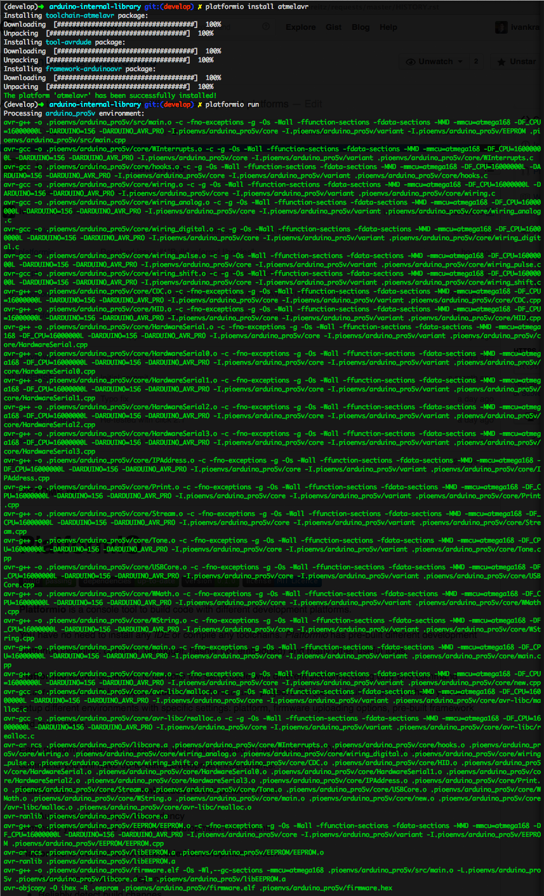

Arduino Example: Build code with internal library
=================================================

1. Download ``platformio``
   `sources <https://github.com/ivankravets/platformio/archive/develop.zip>`_
2. Extract ZIP archive
3. Then run these commands:

.. code-block:: bash

    # Change directory to example
    $ cd platformio-develop/examples/arduino-internal-library/

    # Install Atmel AVR development platform with Arduino Framework
    $ platformio install atmelavr

    # Process example project
    $ platformio run

