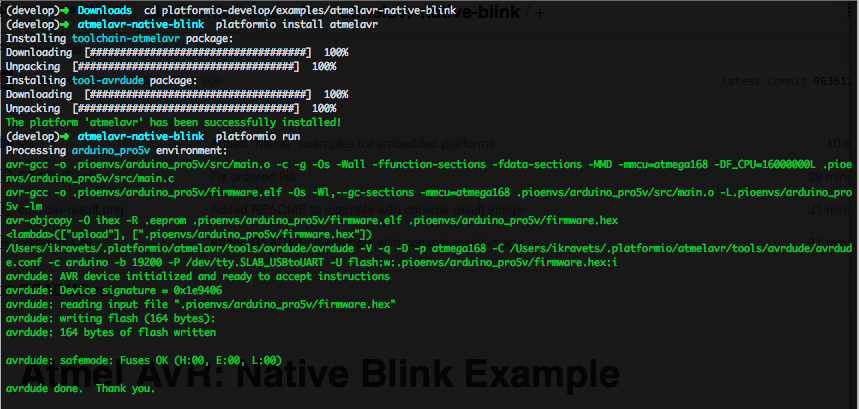

Atmel AVR: Native Blink Example
===============================

1. Download ``platformio``
`sources <https://github.com/ivankravets/platformio/archive/develop.zip>`_.
2. Extract ZIP archive
3. Then run these commands:

.. code-block:: bash

    # Change directory to example
    $ cd platformio-develop/examples/atmelavr-native-blink/

    # Install Atmel AVR development platform
    $ platformio install atmelavr

    # Process example project
    $ platformio run

