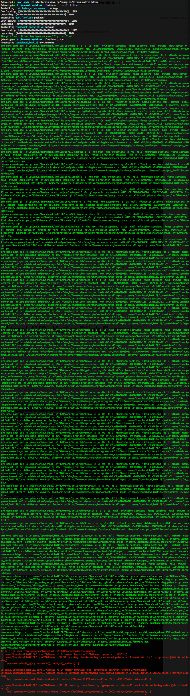

TI TIVA C ARM Cortex-M4: Native Blink Example
=============================================

1. Download ``platformio``
   `sources <https://github.com/ivankravets/platformio/archive/develop.zip>`_
2. Extract ZIP archive
3. Then run these commands:

.. code-block:: bash

    # Change directory to example
    $ cd platformio-develop/examples/titiva-native-blink/

    # Install TI TIVA development platform
    $ platformio install titiva

    # Process example project
    $ platformio run

